# حالات النظام والانتقالات — نَسَق AI

| الحقل | القيمة |
|---|---|
| الإصدار | `0.1` |
| الحالة | عقد سلوكي للـPrototype والBackend MVP |
| آخر تحديث | 11 سبتمبر 2026 |
| المرجع | [PRD](PRD.md) · [Sitemap](SITEMAP.md) · [Screen Inventory](SCREEN-INVENTORY.md) |

> الهدف ليس رسم animation للحالة، بل منع الحالات المستحيلة والتكرار والفشل الصامت. الـFrontend يعرض الحالة؛ الـBackend الحقيقي هو مصدر الحقيقة عندما يبدأ Alpha.

---

## 1. قواعد عامة لكل الآلات

### 1.1 عقد الحالة

كل كيان asynchronous يجب أن يحمل على الأقل:

```text
id
status
statusReason?        // code ثابت + رسالة آمنة
createdAt
updatedAt
version              // optimistic concurrency
lastEventSequence?   // runs/streams
retryability         // retryable | user_action | final
```

### 1.2 قواعد لا تُكسر

1. الانتقال يحدث بأمر أو حدث معلوم، لا بتخمين الواجهة بعد timeout.
2. كل أمر قابل للتكرار يحمل `idempotencyKey` عندما قد يخصم أو ينفذ أثرًا خارجيًا.
3. لا يعود كيان نهائي إلى حالة نشطة؛ retry ينشئ attempt/run جديدًا مرتبطًا بالأصل.
4. `cancel_requested` ليست `cancelled`؛ قد تكون العملية وصلت إلى المزود بالفعل.
5. فشل تحديث الواجهة لا يعني فشل العملية؛ عند الشك ندخل `reconciling` ونطلب الحقيقة.
6. ترتيب أحداث run يعتمد sequence من الخادم؛ timestamps وحدها لا تكفي.
7. لا يختفي الخطأ عند التنقل؛ يظهر recovery action أو رابط details.
8. كل حالة لون لها نص ورمز/شكل مناسب، ولا يعتمد المعنى على اللون.
9. Prototype يحاكي الانتقالات نفسها بزمن ثابت/seeded، ويحمل badge `Demo`.
10. العمليات النهائية تحتفظ بإيصال، حتى عند `failed` أو `cancelled` إذا حدث استهلاك.

### 1.3 الحالات النهائية

الحالة النهائية تعني أن instance الحالي لا يتقدم:

- `completed`
- `completed_with_warnings`
- `failed_final`
- `cancelled`
- `expired`
- `deleted`
- `revoked`

إعادة المحاولة تنشئ instance أو attempt جديدًا مع `parentId`/`retryOf`.

---

## 2. Bootstrap والجلسة

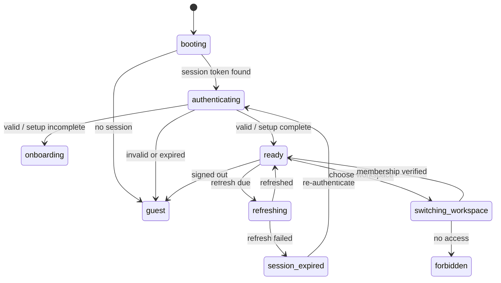
```mermaid
stateDiagram-v2
    [*] --> booting
    booting --> guest: no session
    booting --> authenticating: session token found
    authenticating --> onboarding: valid / setup incomplete
    authenticating --> ready: valid / setup complete
    authenticating --> guest: invalid or expired
    ready --> refreshing: refresh due
    refreshing --> ready: refreshed
    refreshing --> session_expired: refresh failed
    session_expired --> authenticating: re-authenticate
    ready --> switching_workspace: choose workspace
    switching_workspace --> ready: membership verified
    switching_workspace --> forbidden: no access
    ready --> guest: signed out
```

| الحالة | واجهة المستخدم | المسموح |
|---|---|---|
| `booting` | shell skeleton ثابت | لا طلبات مكلفة |
| `guest` | marketing/auth | صفحات عامة فقط |
| `authenticating` | progress دون وميض صفحة login | انتظار |
| `onboarding` | خطوات التهيئة | موارد التهيئة فقط |
| `ready` | التطبيق | حسب الدور والسياسات |
| `refreshing` | التطبيق يبقى؛ مؤشر فقط إذا طال | قراءة؛ الكتابة الحساسة قد تنتظر |
| `session_expired` | dialog يحفظ intent والمسودة | إعادة الدخول |
| `switching_workspace` | تعطيل أوامر متضاربة | cancel/return |
| `forbidden` | شرح وعودة لمساحة سابقة | لا كشف موارد |

**Invariant:** workspace في client ليس دليل صلاحية؛ كل request يتحقق خادميًا.

---

## 3. Onboarding

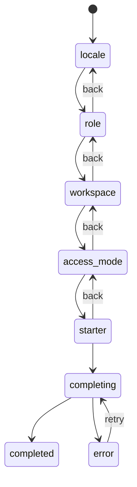
```mermaid
stateDiagram-v2
    [*] --> locale
    locale --> role
    role --> workspace
    workspace --> access_mode
    access_mode --> starter
    starter --> completing
    completing --> completed
    completing --> error
    error --> completing: retry
    role --> locale: back
    workspace --> role: back
    access_mode --> workspace: back
    starter --> access_mode: back
```

### بيانات الخطوات

| الخطوة | ما يجب حفظه | هل يمكن التخطي؟ |
|---|---|---|
| `locale` | locale + numbering preference لاحقًا | لا |
| `role` | persona/use cases | نعم إلى default |
| `workspace` | personal/team + name | لا |
| `access_mode` | trial/credits أو BYOK لاحقًا | نعم؛ default تجريبي في Prototype |
| `starter` | Chat starter أو Project template | نعم إلى Chat فارغ |

### شروط الانتقال

- `completing` أمر idempotent؛ إعادة التحميل لا تنشئ workspace ثانية.
- لا يقبل Prototype مفتاحًا حقيقيًا.
- عند `error` تبقى البيانات المحلية غير السرية ويمكن الرجوع.
- المستخدم المكتمل الذي يفتح route التهيئة يعاد إلى Home، إلا إذا دخل وضع replay تجريبي من الإعدادات.

---

## 4. Composer وإرسال الرسالة

### 4.1 حالة draft

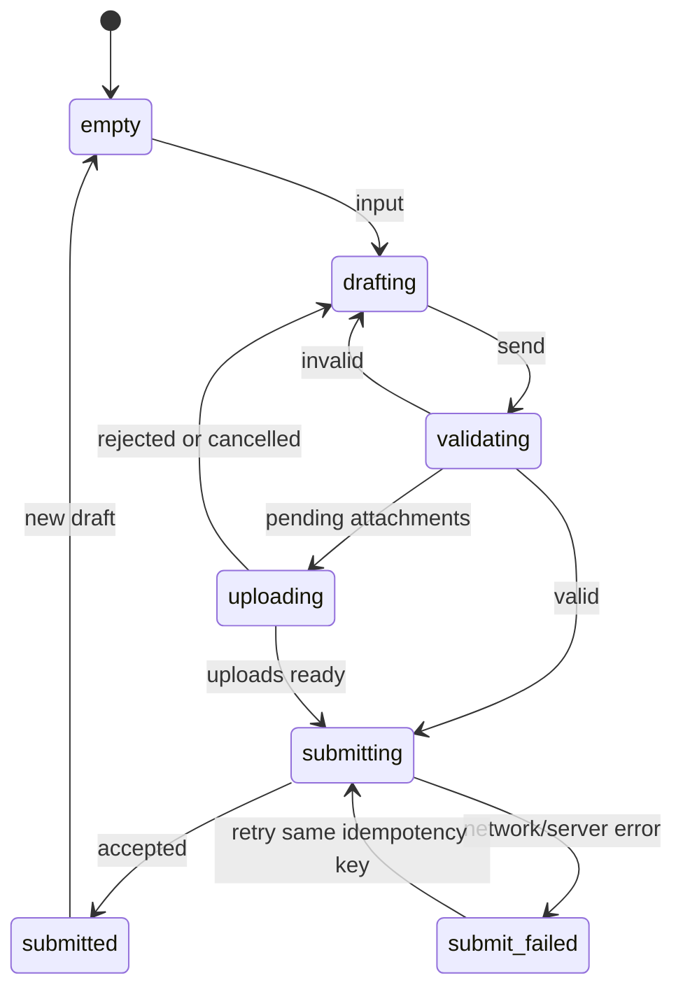
```mermaid
stateDiagram-v2
    [*] --> empty
    empty --> drafting: input
    drafting --> validating: send
    validating --> drafting: invalid
    validating --> uploading: pending attachments
    validating --> submitting: valid
    uploading --> submitting: uploads ready
    uploading --> drafting: rejected or cancelled
    submitting --> submitted: accepted
    submitting --> submit_failed: network/server error
    submit_failed --> submitting: retry same idempotency key
    submitted --> empty: new draft
```

### شروط صحة الإرسال

- نص غير فارغ أو attachment صالح.
- نموذج/سياسة متاحة.
- نوع المدخل مدعوم.
- الصلاحية والرصيد/المفتاح يسمحان.
- لا upload في حالة scanning/failed.
- لا double submit أثناء `submitting`.

### 4.2 رسالة المستخدم

```text
local_draft → submitting → accepted
                         ↘ failed_retryable → submitting
                         ↘ failed_final
accepted → persisted
```

**Invariant:** تظهر رسالة المستخدم في السجل بعد `accepted`، أو optimistic مع حالة واضحة وقابلية rollback؛ لا تظهر كمرسلة نهائيًا قبل قبول الخادم.

---

## 5. استجابة النموذج وStreaming

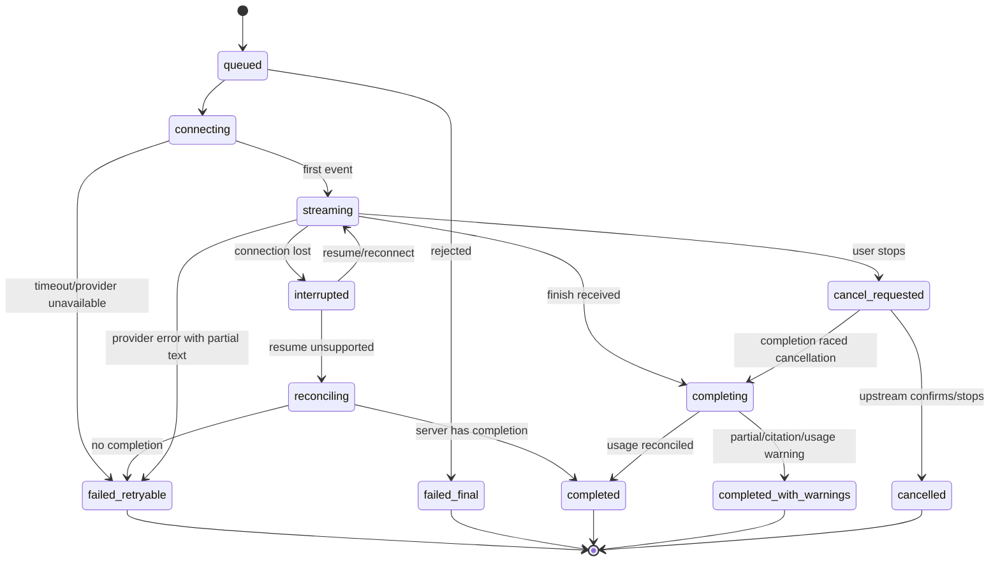
```mermaid
stateDiagram-v2
    [*] --> queued
    queued --> connecting
    connecting --> streaming: first event
    connecting --> failed_retryable: timeout/provider unavailable
    streaming --> completing: finish received
    streaming --> cancel_requested: user stops
    cancel_requested --> cancelled: upstream confirms/stops
    cancel_requested --> completing: completion raced cancellation
    streaming --> interrupted: connection lost
    interrupted --> streaming: resume/reconnect
    interrupted --> reconciling: resume unsupported
    reconciling --> completed: server has completion
    reconciling --> failed_retryable: no completion
    completing --> completed: usage reconciled
    completing --> completed_with_warnings: partial/citation/usage warning
    queued --> failed_final: rejected
    streaming --> failed_retryable: provider error with partial text
    failed_retryable --> [*]
    failed_final --> [*]
    completed --> [*]
    completed_with_warnings --> [*]
    cancelled --> [*]
```

### ما يظهر للمستخدم

| الحالة | العرض | الإجراء |
|---|---|---|
| `queued` | «في الانتظار» وسبب إن وجد | إلغاء |
| `connecting` | مؤشر اتصال لا skeleton متكرر | إلغاء |
| `streaming` | نص متدفق + stop + jump to latest | إيقاف |
| `interrupted` | banner اتصال مع حفظ النص الجزئي | إعادة اتصال تلقائية/يدوية |
| `reconciling` | «نتحقق من حالة الطلب» | انتظار/فتح لاحقًا |
| `completing` | response ظاهر؛ usage قيد التسوية | لا إعادة إرسال فورية لنفس الطلب |
| `completed` | response + details | متابعة/نسخ/تحويل |
| `completed_with_warnings` | response مع تحذير محدد | فحص المصادر/إعادة |
| `cancel_requested` | زر معطل وحالة توقف | انتظار |
| `cancelled` | النص الجزئي محفوظ وموسوم | إعادة المحاولة |
| `failed_retryable` | سبب آمن + retry | retry attempt جديد |
| `failed_final` | سبب وسياسة/حل | تغيير المدخل/النموذج |

### سباق الإلغاء والاكتمال

إذا وصل completion قبل تأكيد cancellation، تكون النتيجة `completed` أو `completed_with_warnings` ويظهر أن الإلغاء وصل بعد الاكتمال. لا نعيد المبلغ تلقائيًا دون usage reconciliation.

---

## 6. المقارنة متعددة النماذج

### الحالة التجميعية

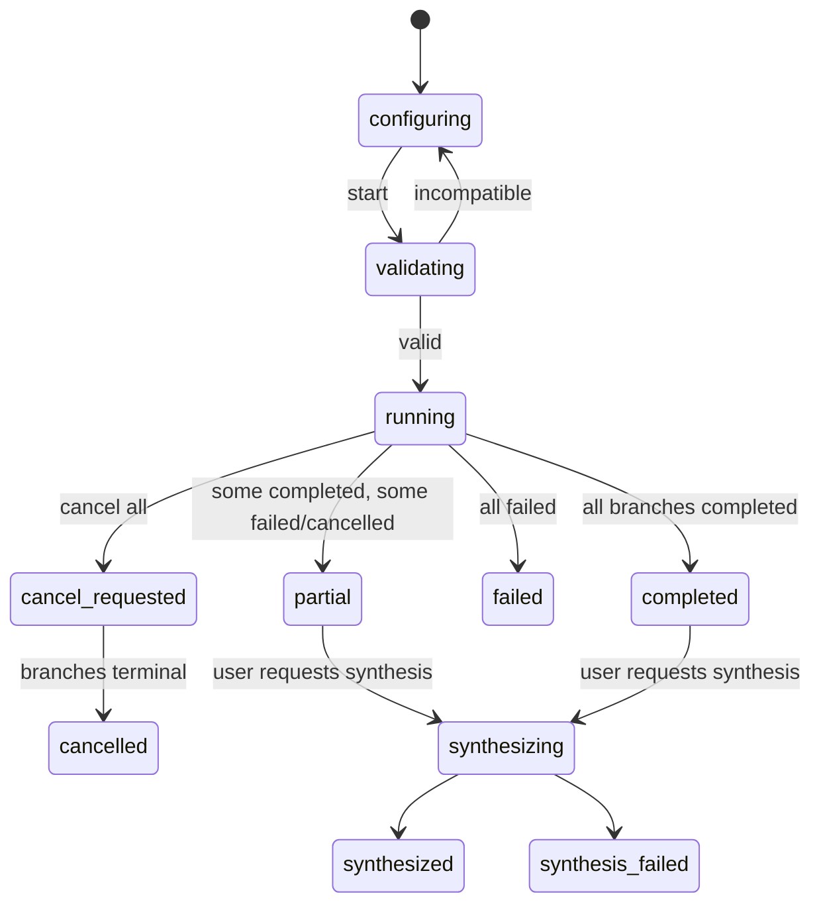
```mermaid
stateDiagram-v2
    [*] --> configuring
    configuring --> validating: start
    validating --> configuring: incompatible
    validating --> running: valid
    running --> completed: all branches completed
    running --> partial: some completed, some failed/cancelled
    running --> failed: all failed
    running --> cancel_requested: cancel all
    cancel_requested --> cancelled: branches terminal
    partial --> synthesizing: user requests synthesis
    completed --> synthesizing: user requests synthesis
    synthesizing --> synthesized
    synthesizing --> synthesis_failed
```

### حالة كل branch

تستخدم آلة response السابقة مستقلًا مع:

```text
comparisonId
branchId
modelId
payer
compatibilityAdjustments[]
usage
```

### Invariants

1. prompt الأساسي والسياق متطابقان قدر الإمكان.
2. أي حذف attachment أو تغيير option بسبب عدم دعم نموذج يسجل ويظهر قبل البدء.
3. فشل branch لا يلغي الناجحة.
4. `synthesis` طلب جديد بتكلفة ونموذج واضحين.
5. اختيار نتيجة لا يحذف البقية.

---

## 7. المرفقات

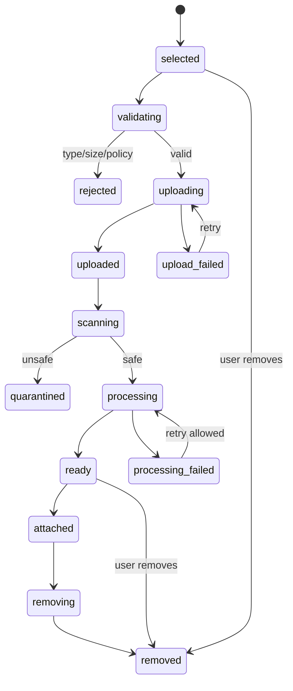
```mermaid
stateDiagram-v2
    [*] --> selected
    selected --> validating
    validating --> rejected: type/size/policy
    validating --> uploading: valid
    uploading --> uploaded
    uploading --> upload_failed
    upload_failed --> uploading: retry
    uploaded --> scanning
    scanning --> quarantined: unsafe
    scanning --> processing: safe
    processing --> ready
    processing --> processing_failed
    processing_failed --> processing: retry allowed
    ready --> attached
    attached --> removing
    selected --> removed: user removes
    ready --> removed: user removes
    removing --> removed
```

### قواعد

- لا يصبح الملف قابلًا للنموذج قبل `ready`.
- `quarantined` لا يقدم تفاصيل قد تسهّل تجاوز الفحص؛ يقدم سببًا وفعل حذف/تواصل.
- إلغاء الرسالة لا يحذف ملف مشروع جاهز، لكنه يزيل الارتباط بالرسالة.
- digest يمنع duplicate upload غير الضروري ضمن النطاق المسموح.
- في Prototype كل الحالات fixtures ولا يرفع الملف إلى خدمة خارجية.

---

## 8. تعريف Agent وإصداره

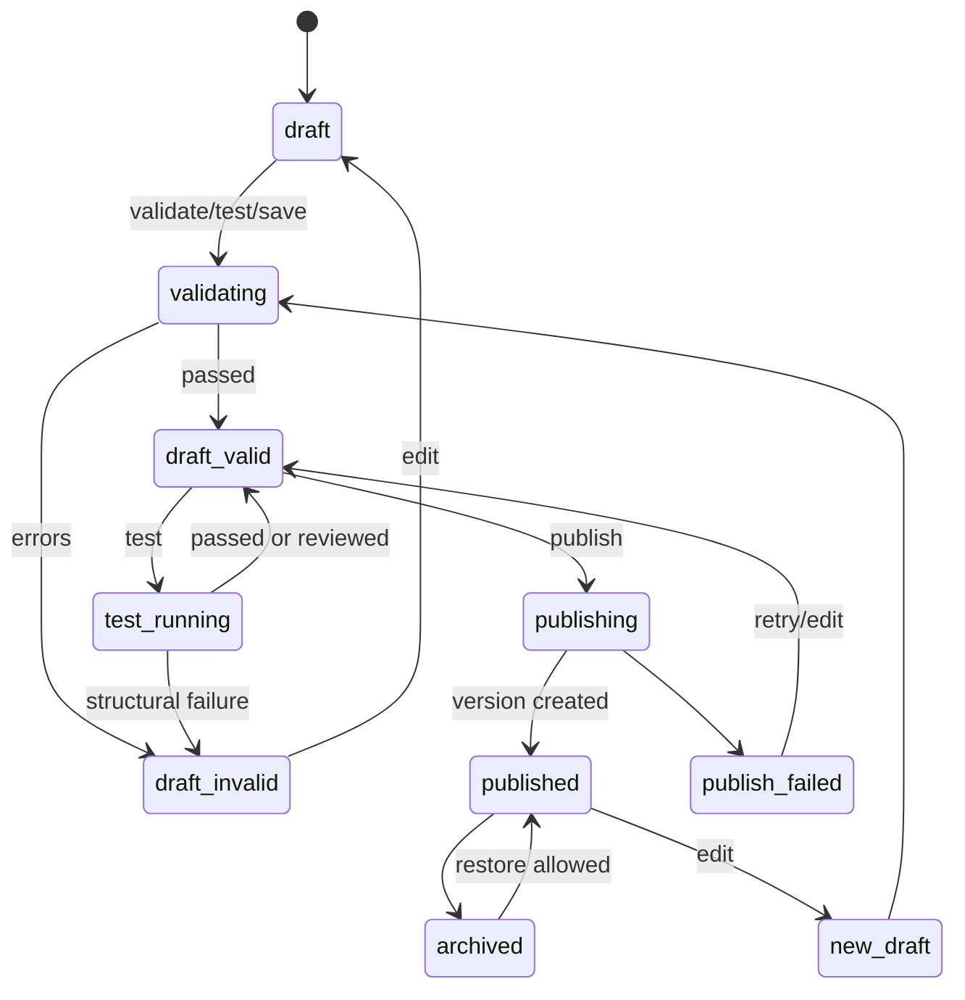
```mermaid
stateDiagram-v2
    [*] --> draft
    draft --> validating: validate/test/save
    validating --> draft_invalid: errors
    draft_invalid --> draft: edit
    validating --> draft_valid: passed
    draft_valid --> test_running: test
    test_running --> draft_valid: passed or reviewed
    test_running --> draft_invalid: structural failure
    draft_valid --> publishing: publish
    publishing --> published: version created
    publishing --> publish_failed
    publish_failed --> draft_valid: retry/edit
    published --> new_draft: edit
    new_draft --> validating
    published --> archived
    archived --> published: restore allowed
```

### Invariants

- `published` immutable؛ أي تعديل ينشئ draft جديدًا.
- run يثبت `agentVersionId` لا `agentId` فقط.
- لا يمكن حذف إصدار مرتبط بـrun؛ يمكن إخفاؤه/أرشفته.
- تغيير tool risk أو credential scope يبطل validation ذات الصلة.
- test لا ينفذ write side effects افتراضيًا.

---

## 9. Agent Run

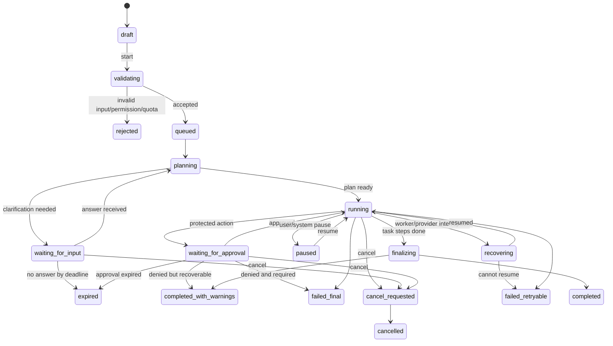
```mermaid
stateDiagram-v2
    [*] --> draft
    draft --> validating: start
    validating --> rejected: invalid input/permission/quota
    validating --> queued: accepted
    queued --> planning
    planning --> waiting_for_input: clarification needed
    waiting_for_input --> planning: answer received
    waiting_for_input --> expired: no answer by deadline
    planning --> running: plan ready
    running --> waiting_for_approval: protected action
    waiting_for_approval --> running: approved
    waiting_for_approval --> completed_with_warnings: denied but recoverable
    waiting_for_approval --> failed_final: denied and required
    waiting_for_approval --> expired: approval expired
    running --> paused: user/system pause
    paused --> running: resume
    running --> cancel_requested: cancel
    waiting_for_input --> cancel_requested: cancel
    waiting_for_approval --> cancel_requested: cancel
    cancel_requested --> cancelled
    running --> recovering: worker/provider interruption
    recovering --> running: resumed
    recovering --> failed_retryable: cannot resume
    running --> finalizing: task steps done
    finalizing --> completed
    finalizing --> completed_with_warnings
    running --> failed_retryable
    running --> failed_final
```

### حالات تفصيلية

| الحالة | هل تحتسب تكلفة؟ | الأفعال المتاحة |
|---|---:|---|
| `draft` | لا | تعديل/بدء |
| `validating` | لا عادةً | إلغاء |
| `queued` | لا أو reservation | إلغاء |
| `planning` | نعم إذا استُدعي نموذج | إلغاء |
| `waiting_for_input` | لا أثناء الانتظار | إجابة/إلغاء |
| `running` | نعم | pause إن كان مدعومًا/إلغاء |
| `waiting_for_approval` | لا للخطوة الموقوفة | approve/edit/deny/cancel |
| `paused` | لا أثناء الوقف | resume/cancel |
| `recovering` | حسب ما اكتمل | انتظار/إلغاء إن أمكن |
| `finalizing` | قد تتم تسوية/توليد artifact | لا تكرار start |
| نهائية | actual فقط | inspect/retry as new run/convert |

### حدود التشغيل

الانتقال إلى `failed_final` أو `completed_with_warnings` عند:

- بلوغ max steps/time/cost وفق السياسة.
- فشل أداة لازمة وعدم وجود بديل.
- رفض موافقة لازمة.
- فقد صلاحية أو credential أثناء التنفيذ.
- انتهاك policy لا يمكن تجاوزه.

### Receipt

يتولد receipt في كل حالة نهائية ويضم:

- run/version/model/tool IDs.
- الهدف والخطة المختصرة.
- الخطوات المكتملة والفاشلة.
- approvals.
- artifacts.
- estimate/actual/adjustments.
- warnings وcorrelation IDs المنقحة.

---

## 10. الموافقة

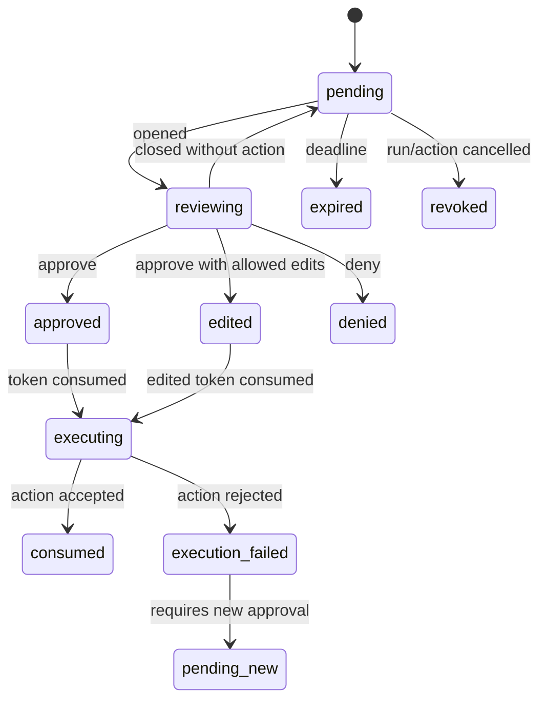
```mermaid
stateDiagram-v2
    [*] --> pending
    pending --> reviewing: opened
    reviewing --> pending: closed without action
    reviewing --> approved: approve
    reviewing --> edited: approve with allowed edits
    reviewing --> denied: deny
    pending --> expired: deadline
    pending --> revoked: run/action cancelled
    approved --> executing: token consumed
    edited --> executing: edited token consumed
    executing --> consumed: action accepted
    executing --> execution_failed: action rejected
    execution_failed --> pending_new: requires new approval
```

### Invariants أمنية

1. approval يرتبط بـaction digest ثابت؛ تغيير payload يبطل الموافقة.
2. approval token أحادي الاستخدام وله expiry.
3. `approved` لا يعني أن الفعل نجح؛ النجاح بعد `consumed`/نتيجة الأداة.
4. refresh أو double click لا ينفذ مرتين.
5. approver يجب أن يملك الصلاحية لحظة القرار والتنفيذ.
6. silence/timeout يساوي `expired`، لا approve.
7. edit مسموح للحقول المعلنة فقط؛ أي تغيير جوهري ينشئ approval جديدًا.

### مستويات المخاطر

| المستوى | أمثلة | السياسة الافتراضية في Alpha |
|---|---|---|
| `read` | بحث عام، قراءة مصدر مصرح | بلا موافقة لكل نداء؛ يظهر في receipt |
| `write_internal` | حفظ artifact داخل المشروع | موافقة أول مرة/حسب policy |
| `external_side_effect` | إرسال بريد، إنشاء ticket | موافقة لكل فعل |
| `destructive` | حذف، نشر نهائي، إلغاء مورد | موافقة صريحة + re-auth عند اللزوم |
| `secret_access` | استخدام credential | policy + scope؛ لا يعرض السر |
| `financial` | شراء/دفع/إنفاق فوق حد | خارج Alpha أو موافقة قوية وحدود |

---

## 11. تعريف Flow ونشره

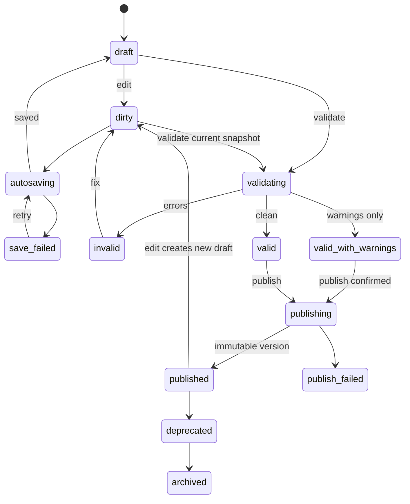
```mermaid
stateDiagram-v2
    [*] --> draft
    draft --> dirty: edit
    dirty --> autosaving
    autosaving --> draft: saved
    autosaving --> save_failed
    save_failed --> autosaving: retry
    draft --> validating: validate
    dirty --> validating: validate current snapshot
    validating --> invalid: errors
    validating --> valid_with_warnings: warnings only
    validating --> valid: clean
    invalid --> dirty: fix
    valid_with_warnings --> publishing: publish confirmed
    valid --> publishing: publish
    publishing --> published: immutable version
    publishing --> publish_failed
    published --> dirty: edit creates new draft
    published --> deprecated
    deprecated --> archived
```

### Validation categories

- structural: start/output/connectivity/cycles.
- contract: input/output type compatibility.
- configuration: model/tool/agent/knowledge selected.
- permission: publisher and runtime principal.
- secrets: credential reference exists and scoped.
- budget: limits set where required.
- safety: side effects behind approval/idempotency.

### Alpha restrictions

- graph acyclic.
- manual trigger only P0.
- no arbitrary code node.
- condition operators allowlisted.
- connectors reviewed only.
- publish requires zero errors؛ warnings need explicit acknowledgment.

---

## 12. Flow Run والعقد

### Flow Run

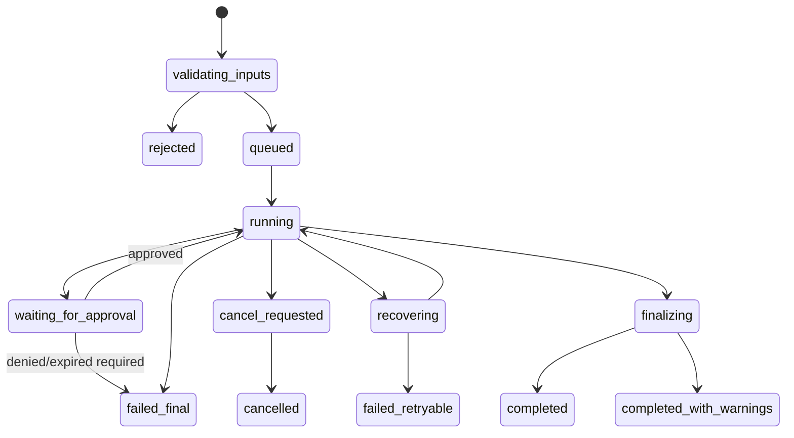
```mermaid
stateDiagram-v2
    [*] --> validating_inputs
    validating_inputs --> rejected
    validating_inputs --> queued
    queued --> running
    running --> waiting_for_approval
    waiting_for_approval --> running: approved
    waiting_for_approval --> failed_final: denied/expired required
    running --> cancel_requested
    cancel_requested --> cancelled
    running --> recovering
    recovering --> running
    recovering --> failed_retryable
    running --> finalizing
    finalizing --> completed
    finalizing --> completed_with_warnings
    running --> failed_final
```

### Node Run

```text
blocked → ready → queued → running
                         ↘ waiting_for_approval → running
                         ↘ succeeded
                         ↘ skipped
                         ↘ failed_retryable → queued (new attempt)
                         ↘ failed_final
                         ↘ cancelled
```

### Invariants

1. node لا يصبح `ready` حتى تنتهي dependencies وتتحقق شروط المسار.
2. `skipped` نتيجة منطقية وليس failure.
3. retry ينشئ attempt جديدًا؛ يحتفظ بالسابق.
4. side-effect node لا يعاد تلقائيًا دون idempotency/approval policy.
5. flow completion يراعي required outputs؛ نجاح بعض العقد لا يساوي نجاح flow.
6. كل run يثبت `flowVersionId`.

---

## 13. Knowledge Source

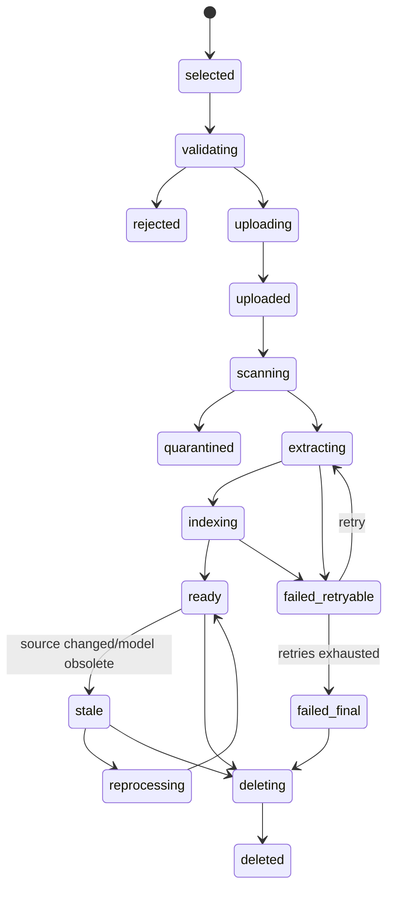
```mermaid
stateDiagram-v2
    [*] --> selected
    selected --> validating
    validating --> rejected
    validating --> uploading
    uploading --> uploaded
    uploaded --> scanning
    scanning --> quarantined
    scanning --> extracting
    extracting --> indexing
    indexing --> ready
    extracting --> failed_retryable
    indexing --> failed_retryable
    failed_retryable --> extracting: retry
    failed_retryable --> failed_final: retries exhausted
    ready --> stale: source changed/model obsolete
    stale --> reprocessing
    reprocessing --> ready
    ready --> deleting
    stale --> deleting
    failed_final --> deleting
    deleting --> deleted
```

### قواعد UI

- `ready` فقط قابل للاسترجاع الافتراضي.
- `stale` يمكن استخدامه فقط إذا سمحت policy، مع تحذير.
- progress يعرض مراحل حقيقية، لا نسبة مختلقة إذا لم نملكها.
- delete يظهر Agents/Flows المتأثرة ويوقف الاستخدام الجديد فورًا.
- مشتقات index تتبع سياسة حذف المصدر.

---

## 14. Provider Credential / BYOK

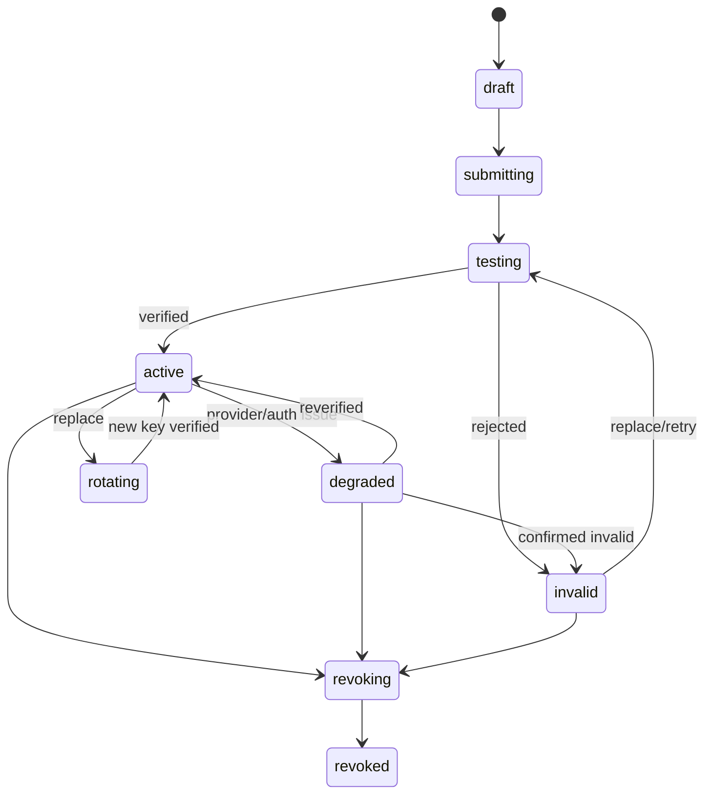
```mermaid
stateDiagram-v2
    [*] --> draft
    draft --> submitting
    submitting --> testing
    testing --> active: verified
    testing --> invalid: rejected
    invalid --> testing: replace/retry
    active --> degraded: provider/auth issue
    degraded --> active: reverified
    degraded --> invalid: confirmed invalid
    active --> rotating: replace
    rotating --> active: new key verified
    active --> revoking
    degraded --> revoking
    invalid --> revoking
    revoking --> revoked
```

### قواعد

- plaintext يوجد في ذاكرة الإدخال لأقصر وقت ولا يعود من API.
- `draft` في Prototype لا يرسل قيمة حقيقية ويظهر Demo.
- `active` يخزن display metadata فقط: label، provider، masked hint إن كان آمنًا، timestamps، scope.
- `degraded` لا يفعّل fallback إلى credits دون policy.
- runs بدأت قبل revoke تتبع kill policy؛ runs جديدة ممنوعة فورًا.
- rotation لا تلغي القديم حتى ينجح الجديد، ثم تلغيه ضمن transaction/عملية موثقة.

---

## 15. Credits وUsage Ledger

### Credit reservation

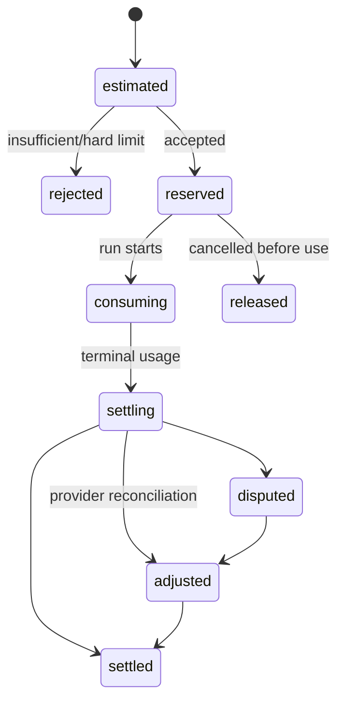
```mermaid
stateDiagram-v2
    [*] --> estimated
    estimated --> rejected: insufficient/hard limit
    estimated --> reserved: accepted
    reserved --> consuming: run starts
    consuming --> settling: terminal usage
    reserved --> released: cancelled before use
    settling --> settled
    settling --> adjusted: provider reconciliation
    adjusted --> settled
    settling --> disputed
    disputed --> adjusted
```

### Invariants مالية

1. money بوحدات integer minor units، لا floating point.
2. `estimate` ليس خصمًا؛ `reserved` ليس actual.
3. idempotency تمنع reservation/settlement المكرر.
4. ledger append-only؛ التصحيح adjustment جديد لا تعديل السجل القديم.
5. BYOK يسجل units/payer حتى إذا كانت model cost صفرًا على فاتورة المنصة.
6. إظهار التكلفة النهائية ينتظر settlement أو يحمل `قيد التسوية`.
7. budget hard limit يتحقق قبل reservation وأثناء التشغيل الطويل.

### Budget

```text
healthy → warning → near_limit → exceeded_soft
                              ↘ blocked_hard
warning/near_limit/exceeded_soft → healthy (new period or limit change)
blocked_hard → healthy (top-up/limit change/new period)
```

تغيير الحد لا يغيّر تاريخ الأحداث، ويسجل في audit log.

---

## 16. دعوة عضو

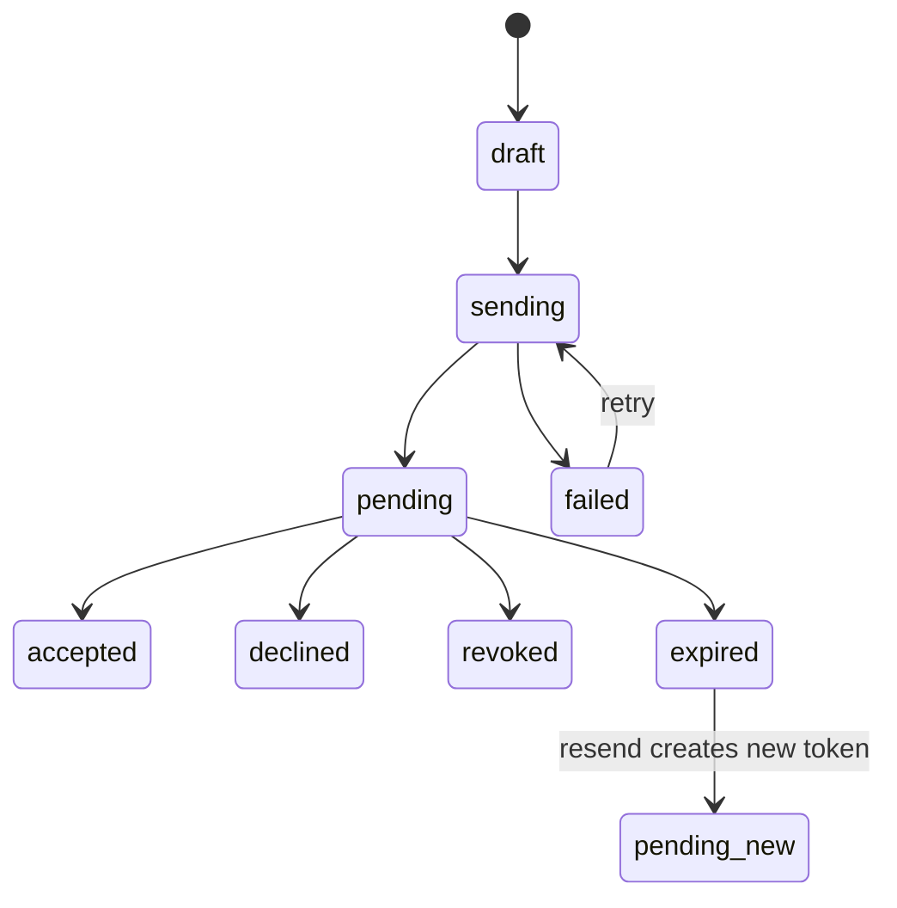
```mermaid
stateDiagram-v2
    [*] --> draft
    draft --> sending
    sending --> pending
    sending --> failed
    failed --> sending: retry
    pending --> accepted
    pending --> declined
    pending --> revoked
    pending --> expired
    expired --> pending_new: resend creates new token
```

### قواعد

- token hashed، أحادي الاستخدام، ومحدد workspace/email/role/expiry.
- resend يلغي token السابق.
- قبول الدعوة يعيد فحص role وسياسة المقاعد وقت القبول.
- wrong-email flow لا يسرّب عضوية أو بيانات الفريق.

---

## 17. المشروع: أرشفة وحذف

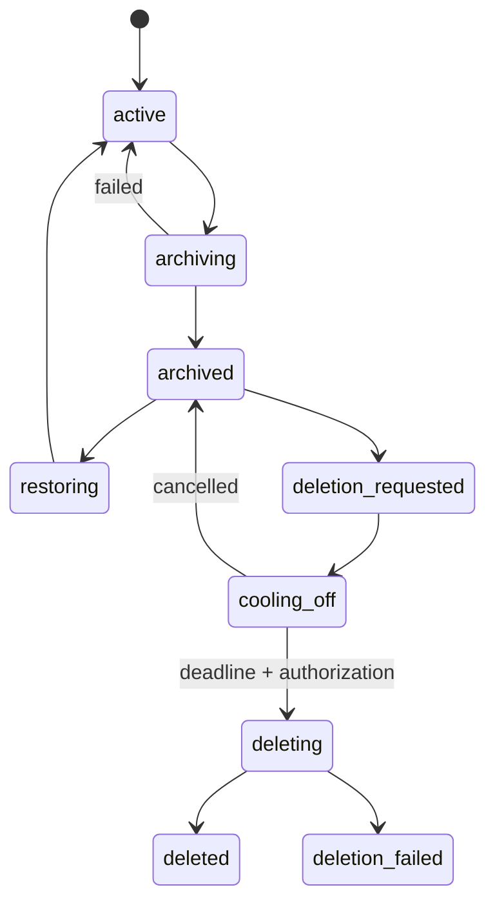
```mermaid
stateDiagram-v2
    [*] --> active
    active --> archiving
    archiving --> archived
    archiving --> active: failed
    archived --> restoring
    restoring --> active
    archived --> deletion_requested
    deletion_requested --> cooling_off
    cooling_off --> archived: cancelled
    cooling_off --> deleting: deadline + authorization
    deleting --> deleted
    deleting --> deletion_failed
```

### قواعد

- archive read-only افتراضيًا ولا يوقف run نشطًا دون شرح/قرار.
- deletion يوضح المصادر والتدفقات والمخرجات والتزامات الاحتفاظ.
- لا تعرض الواجهة deleted resource لمستخدم سابق.
- مدة cooling-off والسياسة القانونية قرار مفتوح قبل Alpha الخارجي.

---

## 18. Offline وReconnect

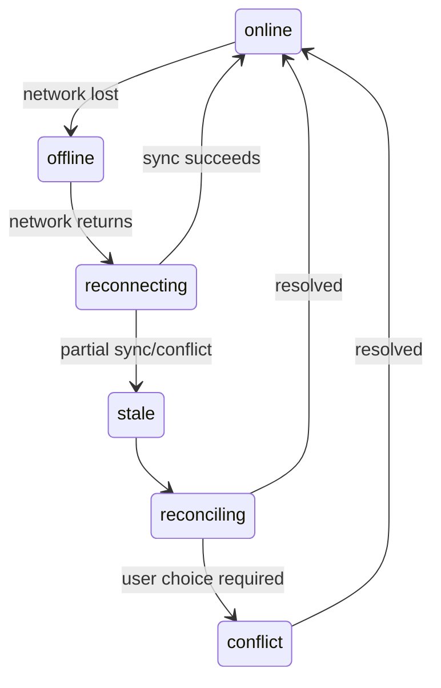
```mermaid
stateDiagram-v2
    online --> offline: network lost
    offline --> reconnecting: network returns
    reconnecting --> online: sync succeeds
    reconnecting --> stale: partial sync/conflict
    stale --> reconciling
    reconciling --> online: resolved
    reconciling --> conflict: user choice required
    conflict --> online: resolved
```

### السلوك

- drafts النصية تحفظ محليًا ضمن سياسة الخصوصية.
- لا queue تلقائي لside effects أو رسائل مكلفة افتراضيًا؛ يطلب تأكيدًا بعد reconnect.
- run قد يستمر في الخادم؛ عند العودة نطلب snapshot وأحداثًا بعد آخر sequence.
- لا نعرض success toast لعملية لم يؤكدها الخادم.

---

## 19. Error model المشترك

| الفئة | retryability | مثال | واجهة المستخدم |
|---|---|---|---|
| `validation` | user_action | ملف غير مدعوم | الحقل/العنصر + إصلاح |
| `authentication` | user_action | جلسة منتهية | إعادة دخول وحفظ intent |
| `authorization` | final حتى تغير الصلاحية | لا يملك edit | شرح/طلب وصول |
| `quota` | user_action | رصيد منتهٍ | top-up/BYOK/خفض النطاق |
| `provider_transient` | retryable | timeout/429 | retry/backoff/بديل بموافقة |
| `provider_final` | user_action/final | model removed | تغيير نموذج |
| `policy` | final/user_action | أداة ممنوعة | شرح السياسة دون طريقة تجاوز |
| `conflict` | user_action | draft version قديم | reload/compare/resolve |
| `internal` | retryable/unknown | unexpected | correlation ID + safe retry |
| `reconciliation` | unknown | نتيجة المزود غير محسومة | pending details، لا خصم نهائي |

صيغة الخطأ التفصيلية تحدد في `CONTRACTS.md`.

---

## 20. أحداث موحدة مطلوبة للـPrototype

يجب أن يستطيع mock event engine توليد على الأقل:

```text
session.ready
workspace.switched
message.accepted
response.started
response.delta
response.citation.added
response.usage.updated
response.completed
response.failed
run.created
run.status.changed
run.plan.updated
step.started
step.progress
step.completed
step.failed
approval.requested
approval.resolved
artifact.created
flow.node.started
flow.node.completed
knowledge.status.changed
credential.status.changed
budget.threshold.reached
```

تسميات transport النهائية قد تختلف، لكن المعنى والترتيب يجب أن يبقيا ثابتين.

---

## 21. سيناريوهات السباق الواجب اختبارها

| ID | السباق | النتيجة المطلوبة |
|---|---|---|
| `RACE-001` | stop يصل مع completion | حالة نهائية واحدة، usage واحد، شرح الترتيب |
| `RACE-002` | approve مرتين من جهازين | token يستهلك مرة؛ الثاني يرى الحالة الحالية |
| `RACE-003` | revoke key أثناء run | لا runs جديدة؛ الحالي وفق kill policy دون تسرب |
| `RACE-004` | publish Flow بينما autosave متأخر | publish snapshot محدد أو يمنع حتى المزامنة |
| `RACE-005` | budget ينفد بين estimate وreserve | reserve يرفض دون رصيد سالب غير مقصود |
| `RACE-006` | عضو يزال أثناء approval | يعاد authorization قبل التنفيذ |
| `RACE-007` | حذف source أثناء retrieval | snapshot/policy واضحة؛ لا citation وهمي |
| `RACE-008` | reconnect بعد event gap | snapshot + events من sequence؛ لا خطوات مكررة |
| `RACE-009` | retry tool بعد timeout مجهول | reconcile أو idempotency قبل إعادة side effect |
| `RACE-010` | تعديل Agent أثناء run | run يستمر على version المثبتة |

---

## 22. معايير قبول حالات النظام

- [ ] كل status مستخدم في fixture معرف هنا أو موثق كامتداد.
- [ ] لا تعرض شاشتان اسمين مختلفين للحالة نفسها بلا سبب.
- [ ] كل انتقال له trigger وguard ونتيجة.
- [ ] final states لا تعود إلى active على instance نفسه.
- [ ] cancel/retry/approve idempotent في المحاكاة والعقود.
- [ ] partial/warning/reconciling ممثلة؛ لا نجاح/فشل ثنائي فقط.
- [ ] refresh وback/forward وoffline لا تكرر العمليات.
- [ ] كل عملية مكلفة تربط estimate/reservation/actual.
- [ ] كل side effect يربط approval/action digest/idempotency.
- [ ] Playwright يغطي سباقات مختارة وحالات الفشل الحرجة.
