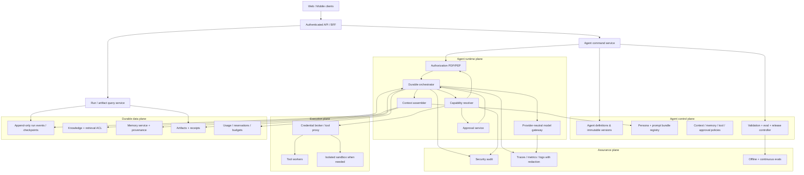

# تدقيق جاهزية هندسة وكلاء المنتج في نَسَق

> **الحالة:** التدقيق مكتمل — هندسة Backend للوكلاء **NO-GO** حتى إغلاق البوابات المحددة هنا
>
> **تاريخ اللقطة:** 12 سبتمبر 2026 — Asia/Aden
>
> **خط الأساس المفحوص:** `main@ab8056b122c3b5cec4cf8cfad8b6bdff9686a0ea`
>
> **النطاق:** هندسة **وكلاء المنتج داخل نَسَق**؛ لا يقيّم هذا التقرير جودة نموذج بعينه، ولا ينفذ Backend أو runtime
>
> **العلاقة مع U2:** U2 Frontend-only يجوز أن تستمر بشرط تطبيق [الملحق الإلزامي](../05-agent-context/U2-PRODUCT-AGENT-BOUNDARY-ADDENDUM.md)

---

## 0. القرار التنفيذي

### الإجابة المباشرة

هندسة وكلاء المنتج في نَسَق **موجودة جزئيًا وموزعة** على مستوى الرؤية، تجربة الاستخدام، متطلبات المنتج، العقود التصورية، آلات الحالة، الصلاحيات، الموافقات، الأمان، والأخطاء. لكنها **ليست بعدُ معمارية canonical مكتملة وقابلة للتنفيذ**، ولا يوجد Backend فعلي يطبقها.

يجب الفصل بين ثلاث طبقات مختلفة:

| الطبقة | الحكم | الدليل المختصر |
|---|---|---|
| منهج عمل وكيل التطوير الذي يبني نَسَق | **مصمم جيدًا** | `AGENT-OPERATING-METHOD.md` يعامل prompts والأدوات والسياق والتقييم والأمن كمنظومة هندسية قابلة للإصدار والتحقق؛ لكنه منهج تشغيل للمطور/الوكيل، لا Product Agent Runtime. |
| تصور منتج نَسَق للوكلاء | **جزئي لكنه قوي** | PRD والرؤية وState Machines وPermissions تصف تجربة الوكيل، النسخ، الموافقات، القيود، الأدوات، الأخطاء، وأهداف Alpha. |
| Agent Runtime canonical + تنفيذه | **ناقص وغير منفذ** | لا توجد موارد مكتملة لـPersona/PromptBundle/ContextPolicy/MemoryPolicy/SkillBinding، ولا orchestrator أو provider adapters أو workers/queue أو database أو policy engine أو credential broker أو eval runner. |

### حكم البدء

| العمل | القرار الآن |
|---|---|
| مواصلة U2 Service Depth كـFrontend simulation | **CONDITIONAL GO** — ضمن عقد U2 والملحق الإلزامي فقط. |
| اعتماد `packages/contracts` الحالي كأساس Backend للوكلاء | **NO-GO**. هذه عقود عرض/Prototype أضيق من الوثائق ولا تمثل canonical runtime. |
| إنشاء جداول Agent/Run أو API حقيقية بناءً على الأشكال الحالية | **NO-GO** حتى إغلاق `PA-G0` إلى `PA-G9`. |
| ربط مزود LLM أو تنفيذ tools/skills أو memory دائمة | **NO-GO**. |
| تنفيذ Research Agent الحقيقي | **NO-GO** حتى إغلاق التصميم والأمن والتقييم ثم بناء vertical slice معزولة. |
| البحث، ADRs، threat modeling، العقود التصميمية، وfixtures/evals غير المتصلة بالإنتاج | **GO** بوصفها أعمال readiness، لا runtime. |

**الخلاصة:** لا ينبغي أن يبدأ Backend الوكلاء الآن. البدء قبل تثبيت الحدود والعقود سيحوّل تفاصيل Prototype ضيقة إلى التزامات تخزين وAPI وأمن يصعب عكسها، وقد يخلق صلاحيات شكلية وموافقات غير قابلة للاستئناف وآثارًا جانبية قابلة للتكرار.

---

## 1. ما الذي دُقق وكيف تُقرأ النتائج

### 1.1 التمييز الملزم

- **Development Agent:** الوكيل/المساعد الذي يقرأ المستودع ويبحث ويعدل ويختبر ويسلم العمل. يحكمه `AGENT-OPERATING-METHOD.md` و`AGENTS.md`.
- **Nasaq Product Agent:** كيان ينشئه مستخدم نَسَق، له تعريف وإصدار وسلوك وسياق وأدوات وصلاحيات وتشغيلات وموافقات ومخرجات.
- **ServiceRun في U2:** محاولة محلية حتمية داخل خدمة Learn/Research/Create/Code/Analyze/Explore. ليست `AgentRun` ولا دليلًا على durability أو authorization خادمي.
- **Simulation:** تغيير UI/fixture داخل المتصفح بلا مزود أو خادم أو أثر خارجي. لا يجوز الاستدلال منه على أن control أمني منفذ.

### 1.2 طريقة التدقيق

1. فحص الملفات الحاكمة: الرؤية، PRD، State Machines، Contracts، Permissions، Frontend Architecture، U2 وعقود التسليم.
2. مقارنة العقود التصورية مع Zod الفعلي في `packages/contracts`.
3. تتبع fixtures وطبقة البيانات إلى `packages/mock-api` و`apps/web/lib/data`.
4. قراءة Agent Builder وRun/Approval UI والاختبارات التي تثبتها.
5. مسح source tree بحثًا عن API handlers، قواعد بيانات، providers، queues/workers، durable engines، prompt registries، eval harnesses، والتنفيذ الديناميكي.
6. مقارنة النتائج بإرشادات حديثة من مصادر رسمية ومعايير ومستودعات مفتوحة؛ استُخدمت المنتديات فقط كإشارات نوعية غير معيارية.

### 1.3 سلم الحالة

- **EXPLICIT:** موثق صراحةً وبحدود مفهومة.
- **PARTIAL:** توجد أجزاء مهمة، لكن لا يكتمل العقد أو enforcement أو lifecycle.
- **SIMULATED:** سلوك واجهة/fixture فقط.
- **MISSING:** لا يوجد artifact canonical أو implementation مطلوب.
- **BLOCKER:** غيابه يمنع Backend آمنًا أو قابلًا للاختبار.

### 1.4 حدود هذا التدقيق

- لا يوجد Backend يمكن اختباره اختراقًا أو تحميلًا؛ معظم مخاطر runtime أدناه **مخاطر تصميم كامنة** وليست ادعاءً بوجود exploit حي الآن.
- لم تُرسل بيانات خاصة إلى مزود ولم تُستخدم مفاتيح API.
- لا يختار التقرير framework أو vendor نهائيًا؛ الاختيار يحتاج ADR مبنيًا على المتطلبات.
- لا يمنح هذا التقرير GO لأي Backend غير متعلق بالوكلاء؛ كل bounded context آخر يحتاج بواباته المناسبة.

---

## 2. خريطة الأدلة داخل المستودع

| المصدر | ما يثبته | ما لا يثبته |
|---|---|---|
| [`AGENT-OPERATING-METHOD.md:580-636`](../../AGENT-OPERATING-METHOD.md) | Prompt contract، versioning، context/prompt engineering، التحقق والأمن لوكيل التطوير. | وجود Product Agent Runtime في نَسَق. |
| [`docs/01-product/PRD.md:470-505`](../01-product/PRD.md) | هدف Agents ومتطلبات builder/run/approval/version/limits/tool-call records وقيود Alpha. | schema نهائي أو خادم يطبقها. |
| [`docs/01-product/PRD.md:890-932`](../01-product/PRD.md) | متطلبات الأمن وجودة AI/evals صريحة. | threat model أو eval corpus أو controls منفذة. |
| [`docs/01-product/STATE-MACHINES.md:307-409`](../01-product/STATE-MACHINES.md) | AgentVersion وAgentRun وapproval lifecycle وreceipts بتفصيل جيد. | durable state أو workers أو replay/recovery منفذ. |
| [`docs/01-product/STATE-MACHINES.md:734-815`](../01-product/STATE-MACHINES.md) | error taxonomy وrace scenarios وidempotency invariants. | error mapper أو reconciliation engine أو اختبارات fault injection. |
| [`docs/03-architecture/CONTRACTS.md:537-608`](../03-architecture/CONTRACTS.md) | Agent/AgentVersion وToolOperation/ToolGrant/ApprovalPolicy تصورية. | Persona أو PromptBundle أو Context/Memory policy أو SkillBinding مكتملة. |
| [`docs/03-architecture/CONTRACTS.md:613-690`](../03-architecture/CONTRACTS.md) | Run/Step/Approval shapes أوسع من الكود. | أنها source of truth تنفيذي أو متوافقة مع Zod الحالي. |
| [`docs/03-architecture/PERMISSIONS.md:143-160`](../03-architecture/PERMISSIONS.md) | فصل تعديل Agent عن حق استخدام credential/tool ومبدأ تقاطع الصلاحيات. | enforcement خادمي. |
| [`docs/03-architecture/PERMISSIONS.md:232-305`](../03-architecture/PERMISSIONS.md) | شروط approval، tool risks، scopes، وترتيب policy evaluation. | policy engine أو one-time approval token. |
| [`docs/00-vision/nasaq-ai-product-vision-ar.md:618-668`](../00-vision/nasaq-ai-product-vision-ar.md) | تصور AI Gateway وModel Registry وrouting. | adapters أو registry منفذة. |
| [`docs/00-vision/nasaq-ai-product-vision-ar.md:683-729`](../00-vision/nasaq-ai-product-vision-ar.md) | مبادئ أدوات/skills/secrets/memory/webhooks. | sandbox، vault، skill verifier أو ACLs منفذة. |
| [`docs/00-vision/nasaq-ai-product-vision-ar.md:876-904`](../00-vision/nasaq-ai-product-vision-ar.md) | تصور خدمات Backend وdurable workflow وSSE resumability. | قرار تقني أو topology أو تشغيل فعلي. |
| [`packages/contracts/src/index.ts:88-122`](../../packages/contracts/src/index.ts) | Zod الفعلي لـAgent summary/definition. | canonical AgentVersion أو behavior bundle. |
| [`packages/contracts/src/index.ts:157-204`](../../packages/contracts/src/index.ts) | Zod الفعلي للخطوات والأحداث والموافقة وrun detail. | event sourcing، causation، idempotency أو durable receipt. |
| [`packages/mock-api/src/index.ts:227-310`](../../packages/mock-api/src/index.ts) | fixtures المحلية التي تغذي واجهة الوكلاء والتشغيل. | model/tool execution أو persistence. |
| [`packages/mock-api/src/index.ts:363-383`](../../packages/mock-api/src/index.ts) | getters تعيد fixture بعد Zod parse فقط. | transport أو API أو authorization. |
| [`apps/web/components/domain/operations/agent-builder-prototype.tsx:31-97`](../../apps/web/components/domain/operations/agent-builder-prototype.tsx) | التحويل إلى view model، حد 8 محلي، test timer، ونشر محاكاة. | validation/eval/publish gate حقيقي. |
| [`apps/web/components/domain/operations/agent-builder-prototype.tsx:104-124`](../../apps/web/components/domain/operations/agent-builder-prototype.tsx) | UX للهوية والتعليمات والأدوات والguardrails والاختبار. | أن هذه الضوابط enforceable خارج React state. |
| [`apps/web/components/domain/operations/run-detail-prototype.tsx:60-109`](../../apps/web/components/domain/operations/run-detail-prototype.tsx) | approval/رفض/اكتمال وreceipt مبنية في المتصفح. | موافقة موثقة خادميًا أو one-time execution. |
| [`apps/web/tests/e2e/wave-two.spec.ts:41-110`](../../apps/web/tests/e2e/wave-two.spec.ts) | E2E لواجهة builder والـapproval/receipt ثنائية اللغة. | authorization، provider/tool failures، resumability، injection، أو durability. |
| [`apps/web/tests/e2e/wave-three.spec.ts:58-80`](../../apps/web/tests/e2e/wave-three.spec.ts) | UX لمراجعة provenance/permissions في catalogs. | سلامة package/MCP أو التنفيذ بعد التفعيل. |
| [`package.json:9-23`](../../package.json) و[`apps/web/package.json:6-46`](../../apps/web/package.json) | المستودع الحالي web app + contracts/mock/i18n/ui واختبارات frontend. | وجود خدمة Backend أو dependency لـDB/queue/orchestrator/provider. |

### 2.1 دليل غياب التنفيذ

عند خط الأساس المفحوص، وبعد استبعاد `node_modules` و`.next` وملفات build:

- لا يوجد source `route.ts`/`route.js` لـAPI داخل `apps` أو `packages`.
- لا توجد حزمة Backend مستقلة.
- لا توجد database schema/migrations أو ORM.
- لا توجد queue/worker أو durable workflow engine.
- لا توجد provider/model transport adapters حقيقية.
- لا يوجد tool executor أو credential broker أو sandbox manager.
- لا يوجد prompt registry أو behavior-bundle release store.
- لا يوجد agent eval runner أو dataset directory.
- لا توجد مطابقة source لاستخدام `eval()` أو `new Function` أو `child_process.exec` في النطاق المفحوص؛ وهذا إيجابي للـPrototype لكنه لا يعادل sandbox policy مستقبلية.

---

## 3. مصفوفة المجالات المطلوبة

| المجال المطلوب | الموجود | الناقص الحاسم | حالة التنفيذ | الحكم |
|---|---|---|---|---|
| Persona / Background | اسم ووصف وهدف وهوية UX؛ المنهج العام يوضح أن persona أداة تركيز لا بديلًا عن العقود. | `PersonaProfile` typed/versioned، المسؤولية، الجمهور، خبرة المجال، tone، non-goals، escalation، disclosure ومنع السيرة المختلقة. | UI فقط. | **PARTIAL / BLOCKER** |
| System Prompt | `instructions` ثنائية اللغة وfixture جيدة نسبيًا. | Prompt bundle هرمي، مصادر التعليمات وأولويتها، templates/typed variables، hash/version، compiler، escaping، token budget، model compatibility، rollback. | لا registry ولا assembly. | **PARTIAL / BLOCKER** |
| Context Management | Projects/knowledge/citations وmemory scope مبادئ عامة؛ منهج وكيل التطوير يغطي compaction/handoff. | فصل app context عن LLM context، durable session عن context window، `ContextPolicy`، selection/budget/trimming/compaction، provenance/freshness/ACL، recovery من full log. | غير منفذ. | **PARTIAL / BLOCKER** |
| Memory | منع cross-project memory وتصوّر personalization. | أنواع الذاكرة، consent، write gate، provenance، tenant/user/agent isolation، retrieval-time validation، TTL/edit/delete/audit/rollback. | غير منفذ. | **MISSING / BLOCKER** |
| Prompt Engineering | `AGENT-OPERATING-METHOD.md` ناضج لوكيل التطوير؛ PRD يطلب regression عند prompt/model/tool change. | Product-specific prompt lifecycle، fixtures/evals، ownership، review، release/canary/rollback وربط كل run بالنسخة. | غير منفذ. | **PARTIAL / BLOCKER** |
| Software Engineering | تصور modular monolith، AI Gateway، orchestrator، workflow، knowledge، billing، audit؛ state machines وعقود أولية. | bounded contexts canonical، ports/adapters، storage/event semantics، consistency model، deployment topology، ADRs، migration strategy. | Frontend فقط. | **PARTIAL / BLOCKER** |
| Tools | مخاطر وscopes وموافقات في docs؛ catalog وbuilder UI. | executable `ToolDefinition/Version/Operation`، input/output schemas، eligibility، per-call auth، timeouts، retry/idempotency/reconciliation، output sanitization، audit. | Simulation. | **PARTIAL / BLOCKER** |
| Skills | Catalog يحمل source/version/license/trust/permissions؛ vision يطلب SHA/diff/scripts/hooks. | `SkillVersion/Binding`، package verification/signature/digest، progressive loading، trust policy، script isolation، revocation، compatibility/evals. | Catalog UI فقط؛ AgentDefinition لا يربط skills. | **PARTIAL / BLOCKER** |
| الصلاحيات والموافقات | وثيقة Permissions قوية، scopes وترتيب policy وشروط approval/action digest. | trusted policy decision/enforcement points، principal model، short-lived credential delegation، single-use approval، reauthorization عند التنفيذ، TOCTOU/replay tests. | لا خادم. | **EXPLICIT DESIGN / MISSING ENFORCEMENT** |
| دورة تنفيذ المهمة | state machine شاملة للتخطيط/السؤال/الموافقة/pause/cancel/recovery/finalize. | durable orchestrator، lease/checkpoint، worker ownership، replay semantics، resumable state، deterministic command handling، compensation. | React state/timers. | **PARTIAL DESIGN / SIMULATED** |
| التحقق والاختبارات | Vitest/Playwright/Axe للـPrototype؛ PRD يطلب AIQ ومجموعة injection. | agent eval corpus، trajectory/tool/arguments، groundedness، Arabic/English/mixed، fault injection، authorization matrix، recovery/idempotency، red team، release thresholds. | UI tests فقط. | **PARTIAL / BLOCKER** |
| الأمان | deny-by-default، sandbox/egress، SSRF، isolation، secrets، audit، kill switches متطلبات صريحة. | threat model/data classification، control ownership، vault/broker، sandbox design، memory/skill/MCP threat controls، incident/runbooks، independent review. | مبادئ غير منفذة. | **PARTIAL / BLOCKER** |
| التعامل مع الأخطاء | error envelope، retryability، common taxonomy، races موثقة تصوريًا. | canonical runtime error type، adapter normalization، unknown-outcome reconciliation، retry budgets/backoff/jitter، DLQ/compensation، safe localization، SLOs. | لا runtime. | **PARTIAL / BLOCKER** |
| Observability / Audit | analytics events وAuditEvent تصوريان، privacy rule تمنع prompt bodies. | trace model، spans/metrics/events، redaction classes، sampling/access/retention، run replay links، alerting وسجلات أمنية غير قابلة للتلاعب. | غير منفذ. | **PARTIAL / BLOCKER** |
| Versioning / Release | AgentVersion تصوري وimmutable invariant؛ PRD يطلب تثبيت النسخة. | behavior bundle كامل ومترابط، provenance/hash، compatibility matrix، eval result، approval، staged rollout، rollback/deprecation. | `version: number` فقط في summary. | **PARTIAL / BLOCKER** |

---

## 4. فروق العقود التي تمنع اعتماد الكود الحالي للـBackend

| الموضوع | الوثيقة التصورية | Zod/واجهة اليوم | الخطر إذا اعتُمدت اليوم |
|---|---|---|---|
| Agent resource/version | `Agent` منفصل عن `AgentVersion` وله `publishedVersionId` وrun يثبت `versionId`. | `agentSummary.version` رقم، و`agentDefinitionSchema` كائن واحد mutable للعرض. | تشغيلات لا يمكن إعادة إنتاجها أو rollback موثوقًا. |
| محتوى تعريف الوكيل | goal/instructions/routing/knowledge/tools/approval/limits/validation. | summary/objective/instructions/modelPolicy/knowledge/tools/approvalPolicy/budget فقط. | لا input/output contracts أو context/memory/prompt/guardrail/eval policies. |
| Persona | غير مفصلة حتى في العقد التصوري. | name/description فقط. | role drift، tone متضارب، وخلفية غير قابلة للإصدار أو الاختبار. |
| Prompt | `instructions: string`. | `LocalizedText` مباشر. | لا hierarchy أو source priority أو template safety أو hash. |
| Tool risk | ست فئات: `read`, `write_internal`, `external_side_effect`, `destructive`, `secret_access`, `financial`. | أربع فئات فقط؛ builder يضغطها إلى low/medium/high. | فقدان semantics أمنية عند round-trip بين UI وBackend. |
| Tool grant | operation IDs + scope + credential ref. | tool ID/name/risk/enabled. | boolean enable قد يتحول إلى صلاحية واسعة بلا resource/operation scope. |
| Skills | الرؤية وcatalog يذكران source/version/license/trust/permissions. | `SkillCatalogItem` منفصل؛ لا binding في AgentDefinition. | skills قد تصبح نصًا أو scripts غير مثبّتة ولا قابلة للتتبع لكل run. |
| Run status | 18 حالة تشمل validating/rejected/paused/cancel_requested/recovering/finalizing/failed_final/expired. | 9 حالات فقط. | فقدان حالات وسيطة وخلط terminal/retry/unknown outcomes. |
| Run identity | type/workspace/project/definition/version/limits/usage/artifacts/approvals/actor/timestamps/sequence. | summary + project + optional agentId/flowId + steps/events/receipt. | لا principal أو pinned version أو policy snapshot أو durable cursor. |
| Run event | `StreamEnvelope` فيه eventId/streamId/sequence/type/time/payload. | sequence/time/kind/translated label/detail. | لا idempotency أو causation/correlation/schema version أو machine replay. |
| Step/tool call | attempt، toolOperationId، error، usage. | view step بكلفة ونص. | لا call ID أو input digest أو attempt semantics أو unknown outcome. |
| Approval | risk، actionDigest، target، cost، editable fields، expiry، actors. | detail أبسط؛ التنفيذ قرار React محلي. | replay/TOCTOU وتغيير payload بعد الموافقة وعدم إثبات هوية الموافق. |
| Error | `ApiError` مع code/retryability/correlation/field errors/safe details. | لا envelope API فعلي ولا normalization. | retries عمياء أو تسريب provider errors أو UX غير قابلة للتعافي. |
| Endpoints | matrix كاملة للvalidate/publish/runs/pause/resume/input/retry/approval. | لا API handlers في source. | العقود أسماء غير مختبرة وليست APIs. |
| Publish/test | state machine تتطلب validation وtest ثم immutable publish. | زر publish يغير React state؛ test يعيد نتيجة ثابتة بعد 650ms. | نشر تعريف غير صالح أو عالي المخاطر بلا gate. |
| Receipt | final receipt مرتبط بالنسخ والخطوات والموافقات والتكلفة والتحذيرات. | JSON يُبنى في browser ويحمل `simulated: true`. | لا authenticity أو tamper evidence أو server execution proof. |

### قرار migration

لا يُوسّع `agentDefinitionSchema` الحالي عشوائيًا حتى يبدو «مستقبليًا». يجب أولًا:

1. وسمه صراحةً كـPrototype read/view model أو وضعه خلف namespace مناسب.
2. تعريف canonical domain resources مستقلة بعد اعتماد البوابات.
3. بناء anti-corruption adapter من fixture/view model إلى النموذج الجديد.
4. إصدار migration/version للـAPI بدل كسر الواجهات بصمت.

---

## 5. الهندسة المستهدفة التي يجب تصميمها قبل التنفيذ

### 5.1 طبقات المسؤولية



هذه **خريطة حدود** وليست أمرًا ببناء microservices. البداية المفضلة في الرؤية هي modular monolith مع workers منفصلة عند الحاجة؛ لكن interfaces والفشل والملكية يجب أن تبقى صريحة.

### 5.2 bounded contexts المطلوبة

| السياق | المسؤولية | ممنوع أن يملكه |
|---|---|---|
| Agent Management | draft، immutable versions، publish/deprecate/rollback، ownership. | تنفيذ الأدوات أو تخزين الأسرار. |
| Behavior Bundle | Persona، prompt templates، schemas، model/tool compatibility، hashes. | authorization أو memory ACL. |
| Run Orchestration | commands، state transitions، checkpoints، leases، retries، compensation، finalization. | قرار صلاحية ذاتي مبني على prompt. |
| AI Gateway | provider adapters، capabilities، normalized errors/usage/cancel، routing receipt. | سياسات business أو نقل صامت بين مزودين. |
| Context Assembly | اختيار وترتيب وتحديد ميزانية وتحويل context مع provenance. | durable truth أو صلاحيات مخمنة. |
| Memory | write/read/update/delete، isolation، provenance، freshness، consent وTTL. | تنفيذ tool أو تجاوز system policy. |
| Knowledge | ingestion/retrieval/citations/ACL/snapshot. | اعتبار النص المسترجع تعليمات. |
| Capability Runtime | Tool/Skill definitions، eligibility، schemas، execution proxy، result validation. | raw credentials أو blanket grants. |
| Authorization | principal، role/resource/action/scope/policy decision، reauthorization. | UI-only checks أو model judgment. |
| Approvals | pending action، digest، expiry، approver، one-time consume، decision audit. | تعديل payload بعد القرار دون digest جديد. |
| Artifacts/Receipts | immutable execution evidence ومخرجات قابلة للإصدار. | ادعاء execution من browser-only payload. |
| Usage/Budget | estimate/reserve/actual/reconcile، hard limits، payer. | float عشوائي أو retry غير محسوب. |
| Assurance | audit، telemetry، evals، redaction، release gates، incident response. | raw sensitive content افتراضيًا. |

### 5.3 الموارد canonical الدنيا

لا تعد هذه الشيفرة عقدًا معتمدًا؛ إنها قائمة الحقول التي يجب حسمها في schema رسمي:

```text
Agent
  id, workspaceId, projectId?, owner, status,
  latestDraftVersionId?, publishedVersionId?, createdAt, updatedAt

AgentVersion (immutable after publish)
  id, agentId, versionNumber, state,
  personaVersionId,
  promptBundleVersionId,
  inputSchemaVersionId, outputSchemaVersionId,
  modelPolicyVersionId,
  contextPolicyVersionId, memoryPolicyVersionId,
  toolGrantVersionIds[], skillBindingVersionIds[],
  guardrailPolicyVersionId, approvalPolicyVersionId,
  executionPolicyVersionId, evalSuiteVersionId,
  validationResult, releaseMetadata, contentDigest, createdBy, createdAt

PromptBundleVersion
  platformPolicyRef, productPolicyRef, personaTemplate,
  taskTemplate, contextTemplate, toolPresentationPolicy,
  outputContract, fallback/escalation policy,
  variablesSchema, tokenBudget, modelCompatibility,
  sourceRevision, digest

ContextPolicyVersion
  source eligibility, trust labels, ordering,
  token budgets, retrieval limits, freshness,
  trimming/compaction rules, durable-log recovery,
  citation requirements, redaction and disclosure

MemoryPolicyVersion
  disabled|session|user|project|workspace scopes,
  allowed entry classes, explicit write intent,
  provenance, ACL, TTL, retrieval validation,
  user view/edit/delete, audit and rollback

ToolDefinitionVersion / ToolOperationVersion
  namespace/name, risk, inputSchema, outputSchema,
  sideEffectClass, idempotency support,
  timeout/retry/reconciliation, result exposure,
  trust/provenance/version/digest

SkillVersion / SkillBindingVersion
  package source, publisher, commit/digest/signature,
  license, compatibility, instructions/resources/scripts,
  requested capabilities, review state, activation policy,
  revocation and eval evidence

AgentRun
  id, workspace/project, principal,
  pinned AgentVersion + all resolved component versions,
  input digest, policy snapshot, status, limits,
  event cursor, pending approvals, artifacts, usage,
  created/started/completed timestamps

RunEvent
  eventId, runId, sequence, eventType, schemaVersion,
  causationId, correlationId, idempotencyKey?, actor,
  redactionClass, safe payload, occurredAt

ToolCallAttempt
  callId, stepId, operationVersionId, principal,
  validated input digest, scope decision, approvalId?,
  attempt, idempotencyKey, timeout, status,
  safe result/error, provider receipt, timestamps
```

### 5.4 Persona/Background الصحيح

Persona ليست اسمًا بشريًا وسيرة مختلقة. يجب أن تكون **ملف مسؤولية وكفاءة قابلًا للاختبار**:

- الدور والمسؤولية والهدف النهائي.
- الجمهور ومستوى اللغة والعربية/الإنجليزية والنبرة.
- نطاق المعرفة المسموح، وما يحتاج retrieval أو سؤالًا.
- قواعد الدليل والمصادر وعدم اليقين.
- ما لا يفعله الوكيل ومتى يتوقف أو يصعّد.
- أسلوب استخدام الأدوات دون منح أي صلاحية.
- disclosure واضح بأنه نظام AI وحدود قدرته.
- إصدار ومالك ومجموعة evals مرتبطة.

`Background` الثابت يساعد في المفردات والمنظور، لكنه لا يُعامل كحقيقة حديثة أو كبديل عن مصدر موثق.

### 5.5 Prompt bundle وترتيب الثقة

يجب أن يجمع runtime المدخلات في طبقات معلومة المصدر بدل concatenation حر:

```text
platform safety invariants
→ tenant/product policy
→ published persona + agent instructions
→ typed task contract
→ permitted tools and schemas
→ trusted application context
→ retrieved/memory candidates with provenance and trust labels
→ durable run state summary
→ user input and attachments as untrusted data
```

- كل template وschema/model/tool set له version + digest.
- المتغيرات typed ومتحققة ومفصولة عن instruction blocks.
- لا يملك retrieved text أو tool output أو memory سلطة تعديل الطبقات الأعلى.
- output schema يتحقق قبل أي side effect.
- prompt change يمر بنفس eval set ويملك rollback.
- لا تُسجل الأسرار أو prompt bodies في telemetry العامة.

### 5.6 Context وMemory

يلزم الفصل بين:

1. **Application context:** principal، workspace، policy helpers، dependencies؛ لا يُرسل كله للنموذج.
2. **Durable session/run state:** سجل كامل للأحداث والقرارات خارج context window.
3. **Model context:** subset مؤقت ومحدود بالـtokens أعده Context Assembler.
4. **Knowledge:** وثائق قابلة للاسترجاع مع ACL/citations/snapshot.
5. **Memory:** معلومات مستمرة عبر الجلسات مع intent/provenance/lifecycle منفصل.

قواعد دنيا:

- full event history قابل للاسترجاع حتى إذا compacted model context.
- context budget موزع ومقاس؛ لا حشو كل التاريخ.
- كل عنصر يحمل source، owner/scope، timestamp، freshness، sensitivity، trust class.
- memory write ليست أثرًا جانبيًا صامتًا؛ تمنع الأسرار والسمات الحساسة غير المصرح بها.
- retrieval يعيد فحص ACL/relevance/freshness/injection قبل الإدخال.
- المستخدم يستطيع رؤية الذاكرة وتعديلها وحذفها ومعرفة أثرها.
- لا ذاكرة مشتركة بين tenants/projects/agents إلا grant صريح ومختبر.

### 5.7 Tool وSkill runtime

- **Tool** قدرة تنفيذية لها operation schemas وأثر ومخاطر وauthorization.
- **Skill** حزمة تعليمات/مراجع/assets وقد تتضمن scripts؛ لا تصبح tool grant تلقائيًا.
- tool discovery/visibility لا يساوي authorization.
- `allowed-tools` أو MCP annotations metadata مساعدة وليست enforcement.
- authorization ينفذ عند كل call على الهوية والoperation والresource والargs والوقت والbudget.
- sensitive call يوقف **نفس run** ويحفظ resumable state.
- approval تربط digest للـtool version + canonical input + target + cost، وتستهلك مرة واحدة.
- الأسرار تبقى في vault/broker خارج model context وsandbox؛ tool proxy يضيفها server-side.
- كل input/output يتحقق؛ outputs تُنقح وتُعامل كبيانات غير موثوقة.
- كل call له timeout، cancellation، retry class، idempotency/reconciliation وaudit.
- skill scripts لا تعمل قبل provenance/review/signature أو digest/sandbox/capability policy.

### 5.8 دورة التنفيذ المرجعية

```text
accept command + idempotency key
→ authenticate and authorize start
→ resolve and pin immutable behavior bundle
→ validate input, availability, budgets, credentials, policies
→ create durable run and first event
→ plan or request clarification
→ assemble bounded context
→ invoke model through normalized gateway
→ validate output / classify final, handoff, or tool proposal
→ resolve capability + reauthorize exact call
→ require and durably persist approval if needed
→ execute idempotently through broker/worker/sandbox
→ validate/sanitize/reconcile result and usage
→ append events and checkpoint after every consequential transition
→ repeat within time/step/cost limits
→ finalize artifacts, usage, warnings, audit, and receipt exactly once
```

### 5.9 Error policy الدنيا

كل خطأ runtime يحتاج:

- stable code وorigin (`input`, `authn`, `authz`, `policy`, `model`, `tool`, `sandbox`, `memory`, `storage`, `budget`, `approval`, `internal`).
- retry class: `transient`, `intermittent`, `permanent`, `unknown_outcome`.
- safe user message/recovery action وcorrelation ID.
- internal cause محمية، دون raw provider payload أو secret.
- retry budget/backoff/jitter/maximum interval وcircuit breaker حسب adapter.
- idempotency key للآثار؛ **لا blind retry** إذا كان outcome مجهولًا.
- reconciliation أو compensation/Saga للخطوات المركبة.
- terminal state واحدة وreceipt يشرح partial work.

---

## 6. سجل المخاطر والثغرات المحتملة

> الأولوية هنا تعني أولوية إغلاق التصميم قبل تفعيل القدرة، لا أن الـPrototype الحالي مخترق بالفعل.

| ID | الأولوية | الخطر الكامن | كيف يظهر | الحد الأدنى المطلوب |
|---|---|---|---|---|
| `PAR-SEC-001` | P0 | Agent goal hijack / direct أو indirect prompt injection | مستخدم/ويب/PDF/tool output يغير الهدف أو يطلب secret/tool خارج النطاق. | trust labels، instruction/data separation، tool-call policy، adversarial evals، fail closed. |
| `PAR-SEC-002` | P0 | صلاحيات شكلية | UI يخفي زرًا أو prompt يقول «لا تفعل» دون server enforcement. | PDP/PEP خادمي، deny default، matrix tests، reauthorization لكل call. |
| `PAR-SEC-003` | P0 | Confused deputy / scope expansion | Agent يملك credential أو tool أوسع من principal/task. | delegated short-lived scopes، intersection policy، resource/argument checks. |
| `PAR-SEC-004` | P0 | تسريب الأسرار | key في prompt/context/log/sandbox أو tool output. | vault + credential broker، non-exportable refs، redaction، secret scanning، no sandbox env tokens. |
| `PAR-SEC-005` | P0 | SSRF وdata exfiltration | web/http tool يصل private/link-local/metadata أو host بعد redirect/DNS rebinding. | egress proxy، allowlist، DNS/IP/redirect policy، response size/type limits، tests. |
| `PAR-SEC-006` | P0 | Approval replay/TOCTOU | approve مرتين أو تغيير payload/target بعد approval. | canonical action digest، expiry، single-use consume، atomic transition، reauth، concurrency tests. |
| `PAR-SEC-007` | P0 | duplicate side effects | worker ينفذ ثم يتعطل قبل acknowledgment؛ retry يكرر الإرسال/الحذف/الدفع. | idempotency keys، provider reconciliation، outbox/inbox أو equivalent، compensation. |
| `PAR-SEC-008` | P0 | فقد durable state | process/container/serverless timeout يمحو run أو approval state. | durable event/checkpoint store، stateless workers، leases، resume/fault injection. |
| `PAR-SEC-009` | P0 | runaway loops/cost | model/tool recursion أو retry storm. | max time/steps/tokens/cost، reservation، rate/concurrency limits، kill switches. |
| `PAR-SEC-010` | P0 | memory poisoning/cross-tenant recall | نص ضار يستمر أو memory مستخدم تظهر لآخر. | gated writes، provenance، user/agent/tenant isolation، retrieval validation، CRUD audit/delete. |
| `PAR-SEC-011` | P0 | Skill/MCP supply-chain compromise | package أو server أو update يغير instructions/scripts/tools. | pinned versions/digests، publisher/provenance/license review، diff/revocation، sandbox، compatibility/evals. |
| `PAR-SEC-012` | P0 | arbitrary code/sandbox escape | code/tool يصل network/filesystem/process/credentials خارج الحدود. | sandbox ADR، isolation، no secrets، egress/resource/time limits، patched images، independent review. |
| `PAR-SEC-013` | P0 | provider fallback يغير الخصوصية/التكلفة | نقل البيانات لمزود آخر بصمت أو payer مختلف. | explicit routing policy/receipt، compatible data policy، user disclosure/consent، no silent fallback. |
| `PAR-SEC-014` | P0 | cross-workspace knowledge/artifacts/events | IDOR أو retrieval دون ACL. | tenant keys/RLS where appropriate، authorization on every read/write/stream، adversarial ID tests. |
| `PAR-SEC-015` | P0 | output-to-action injection | model JSON/text يمر مباشرة إلى shell/SQL/DOM/email/API. | strict schema + semantic validation + destination encoding + policy/approval. |
| `PAR-REL-001` | P0 | unknown outcome بعد timeout | النظام لا يعرف هل tool نفذ، ثم يعيد المحاولة. | explicit unknown state، reconciliation endpoint/receipt، no automatic retry. |
| `PAR-REL-002` | P1 | event tampering/reordering/gaps | UI يعرض success مع أحداث مفقودة أو مكررة. | immutable IDs/sequence/schema version، cursor resume، snapshot reconciliation، integrity controls. |
| `PAR-REL-003` | P1 | cancellation/completion race | billing أو artifact يتكرر أو الحالة تتناقض. | atomic terminal transition، one finalizer، usage reconciliation، race tests. |
| `PAR-REL-004` | P1 | stale definition/prompt/tool drift | تشغيل لا يمكن تفسيره بعد تعديل الكيانات. | pin every component version/digest، immutable publish، retained provenance. |
| `PAR-REL-005` | P1 | provider/model behavior drift | update يخفض الدقة أو يغير tool calls. | model pin/compat policy، recurring evals، canary/shadow، rollback/disable. |
| `PAR-DATA-001` | P0 | sensitive telemetry leakage | raw prompts/files/PII في traces أو eval datasets. | data classification، field allowlist، redaction before export، access/retention، opt-in debug capture. |
| `PAR-DATA-002` | P1 | حذف غير مكتمل | memory/context/artifacts/indexes/backups تبقى بعد delete. | data inventory، propagation map، tombstone + purge jobs، export/delete tests. |
| `PAR-DATA-003` | P1 | citation poisoning أو stale evidence | التقرير يستشهد بمصدر غير مسموح/متغير أو locator غير صحيح. | source snapshot/digest، locator validation، ACL/freshness، citation evals. |
| `PAR-AI-001` | P1 | evals سطحية أو قابلة للتلاعب | قياس النص النهائي فقط أو benchmark إنجليزي عام. | task-specific outcome + trajectory + tool + safety evals، عربي/إنجليزي/mixed، human calibration. |
| `PAR-AI-002` | P1 | false confidence/hidden uncertainty | الوكيل يعطي نسبة غير معايرة أو يخفي missing evidence. | evidence-based categories، limitations، calibrated rubrics، no fabricated scores. |
| `PAR-OPS-001` | P1 | غياب incident controls | tool/provider/agent ضار ولا يمكن تعطيله سريعًا. | kill switches، revocation propagation، alerts، runbooks، security contacts. |
| `PAR-OPS-002` | P1 | queue/backpressure collapse | jobs طويلة تتراكم أو tenant واحد يستنزف workers. | quotas، fair scheduling، concurrency caps، admission control، DLQ/alerts. |
| `PAR-OPS-003` | P1 | audit غير كافٍ أو قابل للإنكار | لا يمكن معرفة من وافق أو أي payload نُفذ. | append-only security audit، actor/action/resource/outcome/digest/request IDs، protected access. |
| `PAR-UX-001` | P1 | استغلال ثقة الإنسان | شرح مقنع يدفع الموافق لاعتماد فعل ضار أو يخفي destination. | exact action/target/payload/cost preview، independent policy summary، edit limits، warning UX tests. |
| `PAR-MA-001` | P1 | handoff spoofing بين وكلاء | subagent يوسّع الصلاحية أو ينقل تعليمات/ذاكرة غير موثوقة. | authenticated envelopes، provenance، scoped delegation، receiver revalidation، no authority inheritance. |

---

## 7. استراتيجية التحقق والاختبارات المطلوبة

### 7.1 طبقات الاختبار

| الطبقة | أمثلة إلزامية |
|---|---|
| Schema/contract | backward/forward compatibility، invalid fields، localized safe errors، version pinning، event ordering. |
| Pure policy/unit | tool eligibility، scope intersection، risk→approval، budgets، retries، terminal-state guards. |
| Adapter contract | normalized provider errors/usage/cancel، tool schemas/timeouts/idempotency، vault never returns secret. |
| Integration | fake provider + fake tools + durable store؛ pause/serialize/resume نفس run؛ revoked identity before execute. |
| Fault injection | crash before/after tool side effect، duplicate event، network partition، worker lease expiry، stale approval، event gap. |
| Security | prompt injection، IDOR، SSRF، exfiltration، memory poisoning، malicious skill/MCP، sandbox escape attempts، log leakage. |
| Agent evals | instruction following، trajectory، tool choice/arguments، groundedness/citations، output schema، final task success، safe refusal/escalation. |
| Language/accessibility | Arabic، English، mixed bidi، approval comprehension، screen-reader/keyboard for live run and recovery. |
| Operational | load/backpressure، budget enforcement، kill switches، restore/delete/export، alerts/runbooks. |
| Release | fixed regression set + shadow/canary metrics + explicit threshold/owner/rollback. |

### 7.2 حالات قبول لا يجوز حذفها

```text
PA-T001  A published AgentVersion remains immutable and every run pins it.
PA-T002  Editing an Agent during a run cannot alter the active behavior bundle.
PA-T003  Two concurrent approvals execute the action at most once.
PA-T004  Changed action payload invalidates the old approval digest.
PA-T005  Worker crash after an external side effect does not duplicate it.
PA-T006  Unknown tool outcome enters reconciliation, not blind retry.
PA-T007  Revoked workspace/project access blocks the next tool/retrieval/action.
PA-T008  A hostile web page/PDF/tool result cannot grant a tool or reveal a secret.
PA-T009  Cross-tenant knowledge, memory, events, and artifacts remain inaccessible.
PA-T010  Context compaction does not destroy the durable run history or resume point.
PA-T011  Memory write requires allowed class, intent, provenance, ACL, and deletion path.
PA-T012  Tool input and output schemas fail closed before a side effect.
PA-T013  Cost/time/step limits stop safely and produce a partial receipt.
PA-T014  Provider fallback never changes privacy/payer/capability silently.
PA-T015  Raw prompts, secrets, and file contents are absent from default telemetry.
PA-T016  Arabic, English, and mixed-bidi evals meet separately approved thresholds.
PA-T017  Citation links/locators and source access are valid at report creation.
PA-T018  Agent/model/prompt/tool/skill changes cannot promote without regression evals.
PA-T019  Kill switches disable new calls and define treatment of in-flight calls.
PA-T020  User export/delete reaches memory, knowledge metadata, artifacts, traces, and indexes in scope.
```

### 7.3 Release bundle

كل إصدار سلوكي يجب أن يسجل على الأقل:

```text
agentVersionId
personaVersionId
promptBundleVersionId + digest
input/output schema versions
contextPolicyVersionId
memoryPolicyVersionId
model policy + resolved model/provider version
ToolOperation versions + grants
Skill versions + digests
approval/guardrail/execution policy versions
eval suite version + dataset digest + thresholds + results
release approver, rollout mode, rollback target, createdAt
```

---

## 8. بوابات readiness الملزمة

لا تعني كتابة artifact أن البوابة PASS؛ يجب أن يراجعه المالك المناسب وتتحول أسئلة P0 إلى قرارات واختبارات قابلة للتنفيذ.

| البوابة | الناتج الإلزامي | معيار الخروج | الحالة الآن |
|---|---|---|---|
| `PA-G0` المصطلحات والحدود | glossary + context map يفصل ServiceRun/AgentRun/FlowRun وAgent/Workflow/Skill/Tool/Memory/Knowledge. | لا اسم مشترك بمعنيين، والمالكون والـAPIs والبيانات محددة. | **FAIL** |
| `PA-G1` التهديد والبيانات | threat model + abuse cases + data classification/flow/retention + assets/trust boundaries. | تغطية OWASP agentic threats، SSRF/secrets/memory/supply chain/multi-tenant؛ مالك/control/test لكل P0. | **FAIL** |
| `PA-G2` متطلبات الجودة | use cases/non-goals + quality scenarios + SLO assumptions + Alpha capability limits. | Research Agent P0 محدود وقابل للقياس؛ side effects المؤجلة واضحة. | **PARTIAL** |
| `PA-G3` النموذج والعقود canonical | schemas/versioning/events/errors/commands/queries/migrations. | جميع invariants قابلة للاختبار؛ لا drift صامت بين docs وZod/API. | **FAIL** |
| `PA-G4` behavior/context/memory | Persona + PromptBundle + ContextPolicy + MemoryPolicy + assembly precedence. | version/hash/provenance/budgets/ACL/write-read-delete/rollback/evals محددة. | **FAIL** |
| `PA-G5` tools/skills/auth/approval | capability model، Tool/Skill lifecycle، scopes، PDP/PEP، vault/broker، approval token. | per-call enforcement، one-time approval، schemas/timeouts/idempotency/supply-chain controls قابلة للاختبار. | **FAIL** |
| `PA-G6` durability/errors | run/event/checkpoint model، retry/reconciliation/compensation، cancel/pause/resume/finalization. | crash/race/unknown-outcome semantics موثقة ومغطاة بخطة fault tests. | **FAIL** |
| `PA-G7` observability/privacy/operations | trace/event/metric schema، redaction/sampling/access/retention، alerts، kill switches، runbooks. | يمكن تشخيص run دون كشف prompt/secret، مع audit منفصل واستجابة حادث. | **FAIL** |
| `PA-G8` evals/release | datasets/rubrics/graders/human calibration/thresholds/CI/canary/rollback. | عربي/إنجليزي/mixed + trajectory/tool/groundedness/safety، وpromotion policy محددة. | **FAIL** |
| `PA-G9` ADRs وخطة التنفيذ | ADRs للتخزين/durable engine/queue/gateway/policy/vault/sandbox/telemetry، migration وvertical slices. | trade-offs، failure modes، cost/ops/data residency، rollback وowners معتمدة. | **FAIL** |
| `PA-G10` مراجعة GO مستقلة | readiness review تربط كل بوابة بالدليل والمالك والمخاطر المقبولة. | Product + Backend/AI + Security/Privacy يوقعون GO محدودًا للـResearch Agent read-only. | **NOT STARTED** |

### قاعدة البوابة

- أعمال الوثائق، النمذجة، التهديد، prototypes المعزولة، وeval fixtures مسموحة قبل PASS.
- لا database/API/provider/worker/tool execution production path قبل `PA-G0..PA-G9 = PASS` وقرار `PA-G10`.
- أي waiver يذكر المالك والسبب والمدة والblast radius والتعويض؛ P0 authorization/secrets/tenant isolation/idempotency لا تُعفى للـAlpha.

---

## 9. خطة المعالجة الكاملة

### المرحلة A — إغلاق التصميم دون Backend

| Work item | الناتج | يعتمد على | شرط الإغلاق |
|---|---|---|---|
| `PA-ARCH-001` | `00-BOUNDARIES-AND-GLOSSARY.md` + context map | هذا التدقيق | `PA-G0` PASS. |
| `PA-ARCH-002` | `01-THREAT-MODEL.md` + abuse-case/test map | 001 | كل P0 له control owner وverification. |
| `PA-ARCH-003` | `02-DATA-CLASSIFICATION-AND-LIFECYCLE.md` | 001–002 | prompt/context/memory/files/events/traces/credentials مصنفة مع retention/delete. |
| `PA-ARCH-004` | `03-QUALITY-SCENARIOS-AND-ALPHA-SCOPE.md` | 001–003 | use cases/non-goals/SLOs/failure budgets قابلة للقياس. |
| `PA-ARCH-005` | `04-CANONICAL-DOMAIN-AND-CONTRACTS.md` | 001–004 | resources/commands/events/errors/version/migration متسقة. |
| `PA-ARCH-006` | `05-PERSONA-PROMPT-CONTEXT-MEMORY.md` | 003–005 | assembly، provenance، token budgets، memory lifecycle، release bundle. |
| `PA-ARCH-007` | `06-TOOLS-SKILLS-PERMISSIONS-APPROVALS.md` | 002,005,006 | scopes/broker/schemas/approval digest/supply chain. |
| `PA-ARCH-008` | `07-DURABLE-RUNTIME-ERRORS-AND-RECOVERY.md` | 005,007 | state/event/retry/reconcile/compensate semantics + race table. |
| `PA-ARCH-009` | `08-OBSERVABILITY-PRIVACY-OPERATIONS.md` | 002–008 | telemetry/audit/redaction/alerts/kill switches/runbooks. |
| `PA-ARCH-010` | `09-EVALS-AND-RELEASE.md` + initial case manifest | 004–009 | metrics, datasets, thresholds, human calibration, rollout/rollback. |
| `PA-ARCH-011` | ADR set + technology decision matrix | 004–010 | choices مع trade-offs وproof spikes غير إنتاجية عند الحاجة. |
| `PA-ARCH-012` | signed readiness matrix | 001–011 | `PA-G0..G9` PASS وقرار `PA-G10`. |

المسار المقترح للملفات المستقبلية:

```text
docs/03-architecture/agent-runtime/
  00-BOUNDARIES-AND-GLOSSARY.md
  01-THREAT-MODEL.md
  02-DATA-CLASSIFICATION-AND-LIFECYCLE.md
  03-QUALITY-SCENARIOS-AND-ALPHA-SCOPE.md
  04-CANONICAL-DOMAIN-AND-CONTRACTS.md
  05-PERSONA-PROMPT-CONTEXT-MEMORY.md
  06-TOOLS-SKILLS-PERMISSIONS-APPROVALS.md
  07-DURABLE-RUNTIME-ERRORS-AND-RECOVERY.md
  08-OBSERVABILITY-PRIVACY-OPERATIONS.md
  09-EVALS-AND-RELEASE.md
  ADR-*.md
```

### المرحلة B — مواصفات قابلة للتنفيذ قبل الخدمات الحقيقية

1. Zod/JSON Schemas canonical في package جديدة أو namespace صريح، بلا coupling مع view models الحالية.
2. state transition library pure واختبارات invariants/races.
3. provider/tool ports مع fake adapters فقط.
4. policy decision contracts وapproval digest fixtures.
5. event/checkpoint/replay fixtures.
6. eval case schema ومجموعة أولى عربية/إنجليزية/mixed.
7. contract migration adapters للـFrontend.

**لا external network، لا real keys، لا side effects في هذه المرحلة.**

### المرحلة C — Runtime foundation

1. Authenticated API + tenant isolation.
2. durable run/event store وorchestrator skeleton.
3. model gateway بadapter واحد خلف fake/controlled environment.
4. context assembler بلا persistent cross-session memory أولًا.
5. read-only tool proxy، credential broker، usage/budget controls.
6. tracing/audit/redaction منذ أول slice.
7. fault-injection integration environment.

### المرحلة D — أول vertical slice: Research Agent read-only

النطاق الأدنى:

- input typed لسؤال البحث ونطاق المصادر والميزانية.
- immutable agent/behavior bundle.
- planning + clarification + web/knowledge read-only allowlists.
- citations وartifact وreceipt.
- لا email، لا نشر، لا destructive tool، لا arbitrary code، ولا shared long-term memory.
- Arabic/English/mixed evals وprompt-injection corpus.
- canary محدود وkill switch.

### المرحلة E — approval + side effect محدود

لا تبدأ قبل نجاح read-only slice. أضف عملية واحدة منخفضة/متوسطة الأثر مثل حفظ artifact داخليًا، ثم اختبر single-use approval، idempotency، crash-after-effect، reauthorization، audit وcompensation. لا تبدأ بإرسال عام أو دفع أو حذف.

### المرحلة F — Private Alpha hardening

- security review مستقل وpenetration/adversarial testing.
- backups/restore/delete/export.
- load/backpressure/SLOs/on-call/runbooks.
- model/provider/skill supply-chain monitoring.
- calibrated continuous evals من failures منقحة.
- cohort وإنفاق وصلاحيات منخفضة أولًا.

---

## 10. قرارات التقنية التي يجب ألا تُتخذ ضمنيًا

| القرار | بدائل يجب مقارنتها | معايير ADR |
|---|---|---|
| Durable execution | Temporal/managed durable platform/DB-backed state machine مدروسة | replay، activity semantics، idempotency، pause طويل، ops، data region، cost، TypeScript support، Vercel topology. |
| Backend topology | modular monolith + workers / services منفصلة | team size، transaction boundaries، deployment/rollback، observability، blast radius. |
| Data store | PostgreSQL + object store + optional vector layer | tenant isolation، transactions، event/query needs، retention/delete، backups. |
| Policy engine | typed in-process policy / Cedar / OPA أو بديل | explainability، testing، latency، versioning، resource/argument auth، operational burden. |
| Model gateway | direct adapters / gateway library or service | provider capability parity، streaming/cancel، usage، data policy، fallback disclosure، vendor lock-in. |
| Prompt registry | Git-backed bundle / DB registry / vendor platform | immutable versions، review، environment promotion، hashes، rollback، secret separation. |
| Evaluation | custom harness + provider-neutral schema / established framework | trajectory/tool metrics، Arabic support، deterministic replay، CI cost، data privacy، human calibration. |
| Observability | OpenTelemetry conventions + chosen backend | trace portability، redaction before export، sampling، access/retention، agent/tool/memory spans. |
| Sandbox | managed sandbox / hardened containers/VMs / none for P0 | isolation proof، secret separation، egress/filesystem/process limits، cold start، incident response. |
| Tool protocol | internal typed operations / MCP-compatible boundary | schemas، auth per request، approvals، timeouts، output validation، server trust/revocation. |

وجود اسم منتج في هذه القائمة لا يعني اعتماده أو السماح بإضافته dependency.

---

## 11. العلاقة الملزمة مع U2

U2 تحسن مساحات الخدمات وتجربتها وهيكلها المحلية، ولا تنشئ Product Agent Runtime. لذلك:

1. `ServiceSession`, `ServiceRun`, `ServiceStage`, `SimulationReceipt`, و`HandoffBundle` تبقى في bounded context الخدمات.
2. لا تُسمى `Run` عامة إذا كان ذلك يجعلها المصدر المشترك مستقبلًا لـAgent/Flow.
3. `SimulationReceipt` ليس `ExecutionReceipt` ولا audit proof.
4. لا تُوسّع `runStatusSchema` الحالي لتسوية احتياجات U2 والوكلاء معًا؛ استخدم schemas محددة بالسياق.
5. لا يُحوّل `agentDefinitionSchema` الحالي إلى جدول أو API canonical.
6. يمكن بناء ports/adapters محلية للمحاكي، لكن لا تختار provider/DB/queue أو تدعي durability.
7. أي حاجة إلى real model/search/file processing/sandbox/telemetry/Backend توقف U2 وتحتاج milestone منفصلًا.
8. يجب على وكيل U2 قراءة [الملحق الإلزامي](../05-agent-context/U2-PRODUCT-AGENT-BOUNDARY-ADDENDUM.md) وتسجيل التزامه في كل receipt متأثر.

---

## 12. تعليمات التسليم لوكيل المعمارية التالي

### المهمة الأولى فقط

نفّذ **المرحلة A / `PA-ARCH-001..012` بوصفها مواصفات ومراجعات**. لا تبدأ Backend ولا تعدّل runtime أو provider/DB/tool execution. ابدأ بـ`PA-ARCH-001` ثم threat/data، ولا تكتب schema تفصيلية قبل تثبيت الحدود والأصول والتهديدات.

### ترتيب القراءة

1. `AGENTS.md`
2. `AGENT-OPERATING-METHOD.md`
3. هذا التقرير كاملًا
4. `docs/05-agent-context/{CURRENT-STATE,HANDOFF,DECISIONS}.md`
5. `docs/01-product/{PRD,STATE-MACHINES,U2-SERVICE-DEPTH}.md`
6. `docs/03-architecture/{CONTRACTS,PERMISSIONS,FRONTEND-ARCHITECTURE}.md`
7. `packages/contracts/src/index.ts` و`packages/mock-api/src/index.ts`
8. المصادر الرسمية والمستودعات في القسم 13، مع إعادة تحقق من الإصدارات الحالية عند التنفيذ.

### مخرجاته

- architecture package المقترحة في القسم 9.
- evidence matrix تحدث كل claim إلى file/section/source.
- open-decision register مع owner/deadline أو stop condition، دون اختلاق اعتماد.
- ADR comparison لاختيار التقنيات، لا dependency installation.
- readiness matrix تعرض PASS/FAIL/WAIVER بالدليل.
- تحديث AGENTS/context/decisions/worklog/receipt عند إغلاق milestone.

### يتوقف ويسأل قبل

- اختيار vendor مدفوع أو إرسال بيانات خاصة.
- تثبيت dependency أو إنشاء Backend/API/DB/migration.
- توسيع Alpha إلى write/external/destructive tools أو persistent memory.
- تغيير U2 أو دمج ServiceRun وAgentRun.
- قبول waiver لمخاطر P0 أو تخفيف control موجود.

---

## 13. المصادر الخارجية والمهارات والمستودعات

تم الوصول إلى المصادر الآتية في 12 سبتمبر 2026 ما لم يُذكر غير ذلك. المصادر الرسمية توجه المتطلبات؛ المستودعات أمثلة للفحص؛ إشارات المجتمع لا تعتمد كمعيار.

### 13.1 مصادر رسمية ومعايير

| المصدر | أثره على هذا التقرير |
|---|---|
| [Anthropic — Building effective agents](https://www.anthropic.com/engineering/building-effective-agents) | ابدأ بأبسط workflow مناسب؛ افصل workflows المحددة عن agents ذات القرار الديناميكي؛ لا تضف framework معقدًا بلا حاجة. |
| [Anthropic — Managed Agents: decoupling brain, hands, session](https://www.anthropic.com/engineering/managed-agents) | session durable خارج harness/context window، وفصل النموذج عن tools/sandbox والاعتمادات. |
| [Anthropic — Writing effective tools for agents](https://www.anthropic.com/engineering/writing-tools-for-agents) | tools ضيقة وموصوفة جيدًا وذات نتائج مقتصدة، لا APIs واسعة مبهمة. |
| [OpenAI Agents SDK — Context management](https://openai.github.io/openai-agents-python/context/) | فصل application context عن LLM context؛ visibility لا تعوض authorization داخل tool/server. |
| [OpenAI — Guardrails and human review](https://developers.openai.com/api/docs/guides/agents/guardrails-approvals) | input/output/tool boundaries مختلفة؛ approval توقف وتستأنف نفس run؛ ضع التحقق بجانب الأثر. |
| [OpenAI — Running agents](https://openai.github.io/openai-agents-python/running_agents/) | loop محدد، max turns، وresumable run state؛ SDK pattern لا يغني عن durability product-level. |
| [OpenAI — Prompt engineering](https://developers.openai.com/api/docs/guides/prompt-engineering) | role/workflow/tool examples، structured outputs، context-window planning، prompt files/templates قابلة للمراجعة. |
| [OpenAI — Evaluation best practices](https://developers.openai.com/api/docs/guides/evaluation-best-practices) | eval-driven development، task-specific datasets، logging cases، continuous evaluation، human calibration. |
| [Google ADK — Agent evaluation](https://adk.dev/evaluate/) | قياس trajectory/tool use والنتيجة النهائية، لا النص وحده. |
| [Google ADK — Sessions and memory](https://adk.dev/sessions/memory/) | session/state قصير الأجل منفصل عن searchable long-term memory وخدماتها. |
| [Microsoft — Manage memory safety in agentic systems](https://learn.microsoft.com/en-us/security/zero-trust/sfi/manage-agentic-memory-safety) | memory كبيانات وcontrol plane: write intent/provenance، isolation، retrieval validation، user CRUD، lifecycle audit. |
| [MCP Tools specification 2026-07-28](https://modelcontextprotocol.io/specification/2026-07-28/server/tools) | input/output schemas، access control، rate limits، sanitization، confirmation، timeouts، audit؛ handles ليست صلاحيات. |
| [Agent Skills specification](https://agentskills.io/specification) و[إضافة دعم skills](https://agentskills.io/client-implementation/adding-skills-support) | package/progressive disclosure؛ project skills غير موثوقة وتحتاج trust gate؛ scripts توسع سطح التنفيذ. |
| [Temporal — Error handling](https://docs.temporal.io/best-practices/error-handling) | transient/intermittent/permanent، idempotent activities، unknown completion edge، compensation/Saga. |
| [OpenTelemetry GenAI semantic conventions repository](https://github.com/open-telemetry/semantic-conventions-genai) | vocabulary لـinvoke-agent/model/tool/retrieval/memory spans؛ المحتوى الحساس يحتاج redaction وسياسة مستقلة. |
| [OWASP Top 10 for Agentic Applications](https://genai.owasp.org/2025/12/09/owasp-top-10-for-agentic-applications-the-benchmark-for-agentic-security-in-the-age-of-autonomous-ai/) | goal hijack، tool misuse، privilege abuse، supply chain، code execution، memory poisoning، insecure inter-agent، cascading failures، human trust، rogue behavior. |
| [NIST SP 800-218A](https://csrc.nist.gov/pubs/sp/800/218/a/final) | secure AI software lifecycle، provenance، protection، verification والتحديث المستمر. |

### 13.2 مستودعات للمقارنة — ليست dependencies معتمدة

- [OpenAI Agents Python](https://github.com/openai/openai-agents-python)
- [Google ADK Python](https://github.com/google/adk-python)
- [LangGraph](https://github.com/langchain-ai/langgraph)
- [Temporal Server](https://github.com/temporalio/temporal)
- [Model Context Protocol](https://github.com/modelcontextprotocol/modelcontextprotocol)
- [Agent Skills](https://github.com/agentskills/agentskills)
- [OpenTelemetry GenAI semantic conventions](https://github.com/open-telemetry/semantic-conventions-genai)
- [Promptfoo](https://github.com/promptfoo/promptfoo)
- [Langfuse](https://github.com/langfuse/langfuse)
- [Arize Phoenix](https://github.com/Arize-ai/phoenix)

يجب فحص license، maintenance، security advisories، data path، version، scripts/transitives، operational burden، وملاءمة العربية قبل الاختيار.

### 13.3 إشارات المجتمع غير المعيارية

- [Hacker News — Apache Burr discussion](https://news.ycombinator.com/item?id=48477400): إشارة نوعية إلى قيمة durable state وtrace-first debugging وتعقيد harnesses.
- [Reddit — practical production agent harness discussion](https://www.reddit.com/r/LangChain/comments/1v2qrmm/looking_for_practical_guidance_on_implementing_an/): إشارة نوعية إلى context bloat، tool eligibility، واختبارات production؛ لا تُستخدم كدليل معياري أو قياس تبنٍ.

### 13.4 المهارات المحلية ذات الصلة

- [Evidence-led agent workflow](../../.agents/skills/evidence-led-agent-workflow/SKILL.md) — activation layer للمنهج canonical.
- [Source-driven development](../../agent-skills-web-uiux/sources/extracts/addy-source-driven.md) — تحقق الإصدار والمصدر قبل القرارات التقنية.
- [Security and hardening](../../agent-skills-web-uiux/sources/extracts/addy-security-hardening.md) — threat model، trust boundaries، SSRF، supply chain، وLLM output safety.
- [Research synthesis](../../agent-skills-web-uiux/sources/extracts/anthropic-research-synthesis.md) — فصل الدليل عن الاستنتاج والفجوات.
- [Web quality audit](../../agent-skills-web-uiux/sources/extracts/web-quality-audit.md) — تحقق runtime/UX/accessibility دون تحويل score إلى دليل مطلق.
- [مكتبة البحث المدققة وفهرسها](../../agent-skills-web-uiux/README.md) — 25 skill مطابقة و11 غير مطابقة في اللقطة؛ لا تنفذ scripts تلقائيًا.

---

## 14. تعريف الجاهزية النهائي

يصبح Backend الوكلاء **READY TO START** فقط عندما:

- `PA-G0..PA-G9` تحمل PASS بدليل حديث ومراجعة أصحاب الأدوار.
- `PA-G10` يمنح GO محدودًا ومكتوبًا لأول Research Agent read-only.
- canonical schemas منفصلة عن Prototype view models ومغطاة باختبارات.
- authorization/approval/secrets/tenant isolation/idempotency ليست prompt أو UI controls.
- durable failure/recovery/unknown-outcome semantics قابلة للاختبار.
- persona/prompt/context/memory/tools/skills/models/evals كلها versioned behavior bundle.
- telemetry/audit مفيدة للتشخيص ولا تسرب المحتوى افتراضيًا.
- evals عربية وإنجليزية ومختلطة، وتشمل trajectory/tool/safety والنتيجة.
- rollout وkill switch وrollback وincident ownership واضحة.
- أول slice ضيقة وقابلة للعكس ولا تملك arbitrary code أو external/destructive tools.

حتى ذلك الحين، الوصف الصحيح هو:

> **Product-agent vision and prototype UX exist; product-agent runtime architecture is incomplete; backend implementation is not authorized to start.**
